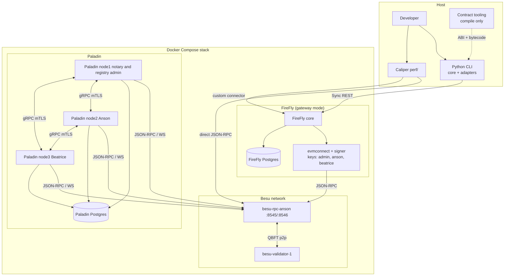
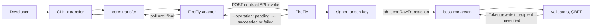
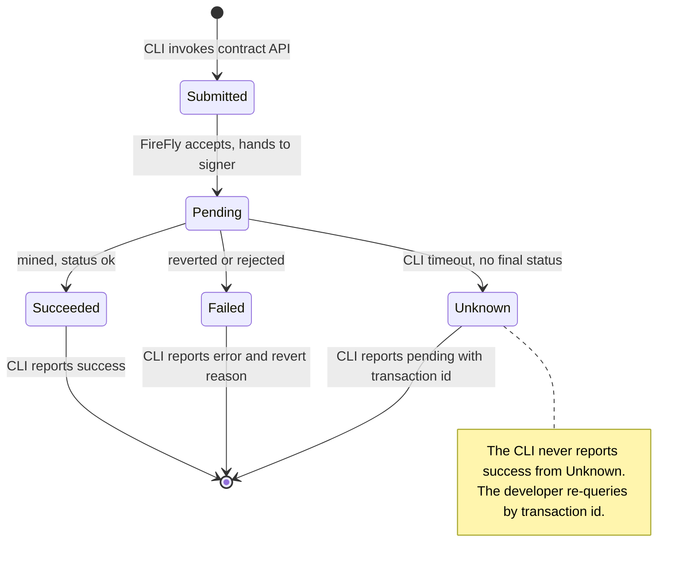
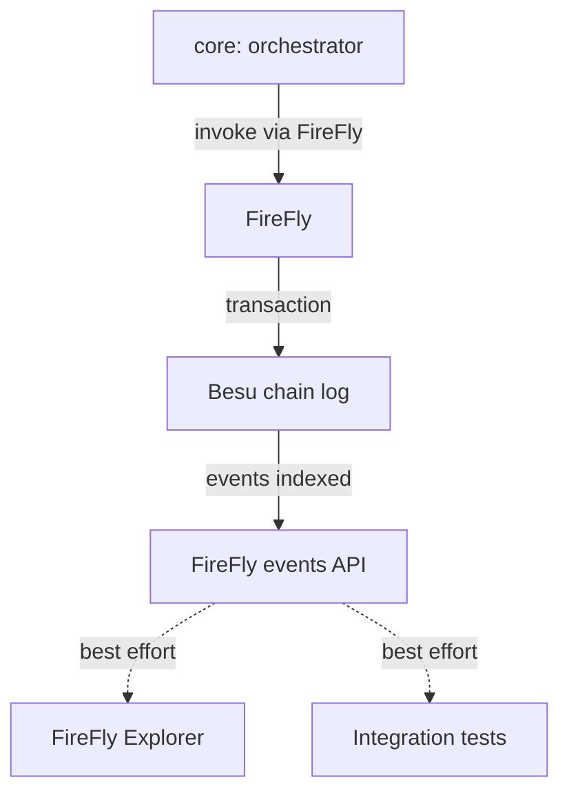

# Architecture — besu-with-firefly

> **Owner:** Howin Ho · **Created:** 2026-10-01 · **Status:** Draft, locked except items that depend on the Phase 0 spike (marked *spike*)
> Decision codes (D-01–D-15) refer to `docs/plan.md` §3.

---

## §1 Overview

**Architecture style: Hybrid.** A small Python modular monolith (the CLI, split into a pure `core` and I/O adapters) in front of an infrastructure tier made of off-the-shelf platforms (Besu, FireFly, Paladin) that this project configures but does not modify. Nothing here is custom-built middleware: the earlier project's `mock-middleware` is replaced by FireFly (D-02).

**Deployment model:** one Docker Compose stack on a single host, no orchestrator, no Kubernetes (D-09). A single `docker compose up -d` starts every container and then runs two one-shot jobs (`paladin-seed`, then `deployer`; Phase 6). The CLI and Caliper run on the host.

Containers:
- `paladin-seed` and `deployer` — one-shot jobs that run once and exit. `paladin-seed` copies the Paladin base configs into `paladin-runtime/`. `deployer` runs `python scripts/stack.py deploy` after everything is healthy and the chain is moving; it mounts the repository (so its outputs land on the host) and the Docker socket (to restart the Paladin nodes), which is acceptable for a local demo only
- `besu-validator-1` — the QBFT validator
- `besu-rpc-anson` — the RPC node (one validator and one RPC node since 2026-10-03, plan D-17; it was 4 validators and 2 RPC nodes)
- FireFly: core, evmconnect, signer, Postgres (gateway mode, single node)
- Paladin: three nodes (node1 notary and registry admin, node2 Anson, node3 Beatrice) and one Postgres (one database per node)

**Data tier:**

| Store | Role | Owner |
|---|---|---|
| Besu chain state | Source of truth for `COIN` balances, identity/claim state, compliance state, and the (opaque) Noto transactions | `besu-validator-*` / `besu-rpc-*`; not persistent, reset by `python scripts/stack.py reset` |
| FireFly Postgres | Registered contract interfaces and APIs, transaction/operation tracking, events | FireFly |
| Paladin Postgres | Private Noto state, one database per node. Must be a persistent volume: Paladin stores its key-path index mapping there, so a wiped DB changes derived key addresses | Paladin |

**External services:** none. Fully local; no SaaS.

**Locked stack decisions:** see `docs/plan.md` §3. Key ones: FireFly gateway mode (D-02), our own genesis (D-03), official T-REX (D-04), Noto only (D-05), Python CLI (D-06), Compose-only (D-09).

---

## §2 Modules / Components and Capability Mapping

| # | Name | Capabilities owned | Data owned | Depth |
|---|---|---|---|---|
| 1 | `src/core/` (Python) | Onboarding sequencing (register → claim → mint, skip-if-already-true), transfer orchestration, error classification (compliance revert vs transport failure); defines the `ChainGateway` port | none | deep |
| 2 | FireFly adapter (Python, implements the port) | HTTP calls to FireFly's contract API, wait-for-confirmation polling | none | shallow |
| 3 | CLI adapter (Python) | Argument parsing, output formatting; calls core only | none | shallow |
| 4 | `network/` scripts | Generate genesis, validator keys, wallet keys, `static-nodes.json`, Compose fragments | generated files | shallow |
| 5 | Besu network | QBFT consensus, JSON-RPC, WebSocket | chain state | deep (third-party) |
| 6 | FireFly (gateway mode) | Contract deploy API, contract interface and API generation, transaction tracking, events, signing for `admin`/`anson`/`beatrice` | FireFly Postgres | deep (third-party) |
| 7 | Paladin + Noto | Private token mint/transfer, notary validation, node registry | Paladin Postgres | deep (third-party) |
| 8 | T-REX contract suite (on-chain) | Identity, claims, compliance, token; the real authorization boundary | chain state | deep |
| 9 | `perf/` (Node, Caliper) | Benchmark rounds, wallet setup, results | report files | shallow |

**MVP simplification block:**

| Component | MVP (ship this) | Later upgrade |
|---|---|---|
| Paladin domains | Noto only | Zeto, Pente, ERC-3643 inside Pente (FR-16, FR-17) |
| CLI scope | FireFly only | Paladin commands (FR-18) |
| FireFly mode | Gateway, single node | Multi-party, two members (FR-19) |
| Chain data | Ephemeral | Optional persistent volumes (FR-20) |

Net effect: all nine units are active in MVP; only the capabilities listed are deferred.

**Topology:**

*Confirmed by the spike:* each Paladin node attaches to a Besu RPC node, and one Postgres server holds one database per node. All three Paladin nodes use the single RPC node `besu-rpc-anson`, as the spike did.

---

## §3 Integration Patterns Per Interaction

| Interaction | From → To | Pattern | Why this pattern |
|---|---|---|---|
| CLI command → business logic | CLI adapter → `core` | Direct call | Same process; core has no I/O |
| Chain operation | `core` → FireFly adapter → FireFly | Sync REST, then poll the transaction/operation until final | FireFly returns a pending record immediately; the CLI waits so the user sees a settled result |
| FireFly → chain | FireFly (evmconnect/signer) → `besu-rpc-*` | Direct chain call (JSON-RPC) | FireFly is the sole signer for `COIN` traffic |
| Paladin → chain | Paladin nodes/notary → `besu-rpc-*` | Direct chain call (JSON-RPC and WebSocket) | Paladin submits its own base-ledger transactions |
| Paladin node ↔ Paladin node | node1 ↔ node2 ↔ node3 | Paladin gRPC with mTLS; peers are found through the on-chain EVM registry | Keeps Noto state off the public chain; the certificate CN must equal the node name |
| Contract deploy | CLI → FireFly deploy API | Sync REST | The "real process" (D-04) |
| Benchmark, chain layer | Caliper → `besu-rpc-*` | Direct chain call | Baseline without FireFly |
| Benchmark, FireFly layer | Caliper (custom connector) → FireFly | Sync REST | Same transfer, through the gateway |
| Event visibility | FireFly → developer | FireFly events and Explorer | Observability only; not part of settlement |

**Failure handling on critical paths:**

| Path | Failure mode | Behaviour |
|---|---|---|
| CLI → FireFly | FireFly unreachable | CLI exits non-zero with a transport error; no retry |
| FireFly → chain | Contract reverts (e.g. unverified recipient) | FireFly marks the operation failed with the revert reason; the CLI classifies it as a compliance error and prints the reason |
| FireFly → chain | Transaction submitted but never mined | The CLI times out waiting and reports "pending/unknown" with the transaction id; it never reports success |
| Write retried by the user | Same logical write sent twice | *Spike:* FireFly's idempotency options for contract-invoke are confirmed in Phase 0. Until then, `core` checks state first (skip-if-already-true) so onboarding steps are safe to repeat |
| Paladin → Besu | Node cannot reach RPC | Paladin node reports unhealthy; Noto calls fail; `COIN` path is unaffected |
| Stack partially reset | Chain reset but FireFly or Paladin DB retained | Prevented by `python scripts/stack.py reset`, which clears all three together (FR-11) |

**Critical path — compliant transfer:**

---

## §4 Event Catalog

> Not applicable as an internal catalog — this design has no event broker of its own and no custom domain events.

Two external event sources exist and are observed, not produced, by this project:
- **On-chain events** from the T-REX contracts (e.g. `Transfer`), surfaced by FireFly's events API and the FireFly Explorer. Observability only; settlement is decided by the transaction/operation status, never by an event.
- **Paladin events** for Noto transactions, available from the Paladin API.

Schema versioning is owned by the contract ABI (on-chain) and by FireFly/Paladin themselves; this project adds no envelope.

---

## §5 Event Sourcing and CQRS — Scope and Rationale

- **Event sourcing:** not used. The chain is the append-only source of truth for balances and compliance state; nothing in this project replays events to rebuild state.
- **CQRS:** not used. Reads (`balanceOf`, `isVerified`) and writes both go through FireFly's contract API. There is no read model.
- **Why correct here:** a solo local PoC with no read/write scaling divergence. Both patterns would add replay and projection code with no payoff.

**Primary lifecycle — a FireFly write operation** (states per FireFly's transaction/operation model; *spike* confirms the exact status names for the pinned version):

**Decision rule:** a flow is orchestrated when one owner must enforce an order and an invariant across several writes before the next one is safe (onboarding: register before claim before mint). A flow is choreographed when independent observers only want to know that something happened (chain events shown in the Explorer).

---

## §6 Per-Module Rationale

**`src/core/`:**
- Forces: onboarding order and error classification must be testable without a network, and `PROJECT.md` forbids I/O in core.
- Alternative: put sequencing in the CLI commands.
- Rejected because: logic in the adapter cannot be unit-tested without mocking the terminal, and a future web adapter would duplicate it.

**FireFly adapter:**
- Forces: FireFly's REST shapes and polling are an infrastructure detail.
- Alternative: let core call `httpx` directly.
- Rejected because: it would break the dependency direction in `CLAUDE.md` §10 and make core untestable offline.

**CLI adapter:**
- Forces: argument parsing and output formatting are I/O.
- Alternative: skip the CLI and use FireFly's Swagger UI.
- Rejected because: the user asked for a client, and a CLI is what `pytest` integration tests can drive and assert on.

**`network/` scripts:**
- Forces: genesis must be generated by Besu's own tool so `extraData` matches the validator keys; `ff init`'s generated genesis is a single-node Clique chain (D-03).
- Alternative: let `ff init` provision the chain.
- Rejected because: it cannot produce our own QBFT genesis with our own validator key, which is the point of the project.

**FireFly (gateway mode):**
- Forces: the user asked for FireFly's real contract-deploy and API-generation process.
- Alternative: multi-party mode with two members.
- Rejected because: it adds IPFS, data exchange and a second FireFly stack for no benefit to this project's learning goals (D-02 decision on mode); kept as FR-19.

**Paladin + Noto:**
- Forces: a privacy demonstration on the same Besu network.
- Alternatives: Zeto (ZK) or Pente (private EVM).
- Rejected for MVP because: Zeto needs circuit and proving-key tooling, and Pente only matters for running ERC-3643 privately, which is deferred (D-05).

**T-REX suite (on-chain):**
- Forces: the compliance guarantee must be the real authorization boundary.
- Alternative: enforce compliance in the CLI.
- Rejected because: anyone calling the chain directly would bypass it.
- Alternative: the earlier project's trimmed contracts.
- Rejected because: the official suite was chosen for fidelity (D-04), accepting a longer deploy.

**`perf/` (Caliper):**
- Forces: Caliper is Node-based and needs its own `package.json`.
- Alternative: a Python load script.
- Rejected because: the user asked for Caliper specifically, and its Besu connector gives a standard result format.

---

## §7 Integration Pattern Decisions and Rationale

**A. CLI → FireFly, Sync REST + poll**
- Forces: FireFly's writes are asynchronous; the user needs a settled result.
- Alternative: subscribe to FireFly events over WebSocket to learn completion.
- Rejected: polling a single operation is simpler and works in tests; events are observability, not settlement.

**B. Contract deploy through FireFly's deploy API**
- Forces: D-04, "the real process".
- Alternative: Hardhat `deploy` signed directly against the RPC node (as the earlier project did).
- Rejected: it bypasses FireFly, so FireFly's contract tracking and nonce state would not see the deployment.

**C. Paladin connects directly to Besu**
- Forces: Paladin is its own node and submits its own base-ledger transactions.
- Alternative: route Paladin through FireFly.
- Rejected: no supported integration was found in the research; they are separate projects.

**D. Caliper direct RPC for the chain baseline**
- Forces: a baseline with no gateway in the path.
- Alternative: benchmark only through FireFly.
- Rejected: then gateway overhead could not be separated from chain cost.

---

## §8 Orchestration vs Choreography Deep Dive

**Decision rule:** orchestrate when one owner must enforce step order and cannot let a step be skipped; choreograph when observers only need best-effort notice and no invariant depends on them.

**What we orchestrate:**
- **Owner:** `core` (called by the CLI).
- **Onboarding sequence:** ① check `isRegistered` → ② `registerIdentity` if not → ③ check `isVerified` → ④ `issueClaim` if not → ⑤ `mint` (the contract also requires a verified recipient).
- **Transfer sequence:** ① invoke `transfer` through FireFly → ② wait for a final status → ③ report the result. Compliance is enforced on-chain, not here.
- **Why mandatory:** skipping the state checks sends redundant transactions that cost a full block wait each; the contract is the final backstop.
- **Failure handling:** `core` classifies reverts as compliance errors and transport failures separately and never swallows a failed step.

**What we choreograph:**
- **Chain:** T-REX events → Besu log → FireFly events/Explorer. Independent observers; no invariant; a missed view costs nothing because the transaction status is the settlement record.

**Hybrid boundary:** the chain's own log acts as the durable record; FireFly indexes it. `core` stays a strict orchestrator for anything the user is waiting on, and any number of observers can watch the same events without `core` knowing.

**Failure modes:**

| Pattern | Typical failure mode | Mitigation in this design |
|---|---|---|
| Orchestration (`core`) | God-service creep | Core owns only onboarding and transfer sequencing, and reaches the chain through one port |
| Choreography (events) | Missed event | Never used for settlement; settlement is read from the operation/transaction status |

**When to revisit:** if a second consumer ever needs guaranteed delivery of chain events, build a durable consumer on FireFly's events API with its own checkpointing.

---

## §9 Tech Stack and Rationale

**Defaults:**

| Layer | Default |
|---|---|
| CLI and tests | Python 3.11+, `ruff`, `mypy`, `pytest` |
| HTTP client (adapter) | `httpx` |
| Contracts | Solidity, compiled with Hardhat (compile only; deploy goes through FireFly) |
| Chain | Hyperledger Besu, QBFT, zero-gas |
| Gateway | Hyperledger FireFly, gateway mode, `evmconnect` |
| Private tokens | Paladin `lfdecentralizedtrust/paladin:v1.0.0`, Noto |
| Performance | Hyperledger Caliper 0.6.0 (Node.js) in `perf/`; `web3@1.3.0` installed by hand because 0.7.1 dropped the Ethereum connector |
| Deployment | Docker Compose, single host |
| Keys and genesis | Generated by script; demo keys committed (D-10) |
| Image versions | Pinned after the spike |

**Per-unit deviations:**

| # | Unit | Frontend | Backend | Data | Notable choices and rationale |
|---|---|---|---|---|---|
| 1 | FireFly | n/a (built-in Explorer) | FireFly core, `evmconnect`, FireFly signer; no data exchange or IPFS in gateway mode | Postgres | Hand-written Compose, not `ff start`. evmconnect needs `fixedGasPrice: 0` and `confirmations.required: 0`; the signer reads `/etc/firefly/firefly.ffsigner.yaml` and a keystore folder with one JSON and one `.toml` per key; core needs a hand-written `namespaces` block with `multiparty.enabled: false` |
| 2 | Paladin | n/a | `lfdecentralizedtrust/paladin:v1.0.0`, three nodes | Postgres, one database per node | Not `kaleidoinc/paladin` (last updated Nov 2024). Hand-written config because the operator normally generates it. Postgres, not SQLite (SQLite stalled the coordinator). Self-signed TLS per node, CN equal to the node name. Two-phase bootstrap and registry registration. `tmpfs` for `/app/jna` needs the `exec` option |
| 3 | Besu | n/a | Besu image, version pinned | ephemeral | Fork level Shanghai or later with `zeroBaseFee` (D-08, *spike*) |
| 4 | `perf/` | n/a | Node.js | files | Separate `package.json`; Node version set by the spike |

**Alternatives explicitly rejected:**
- `mock-middleware` — replaced by FireFly (D-02)
- `ff init`'s generated chain — single-node Clique; Clique block production has also been removed from recent Besu builds
- Kubernetes for Paladin (operator, Helm, `kind`) — Compose is enough and keeps one tool (D-09); kept as the fallback if the spike shows Paladin cannot run from hand-written config
- Paladin's own devnet Besu — would split us from the shared Besu network
- FireFly multi-party mode — deferred (FR-19)
- Zeto and Pente — deferred (FR-16, FR-17)
- A web frontend and Playwright — out of scope; FireFly's Explorer covers visibility
- Python load scripts instead of Caliper — Caliper requested (D-14)
- Hardhat deploy straight to the RPC node — bypasses FireFly (D-04)

---

## §10 Security Measures

**Baseline controls:**
- No authN/authZ anywhere. Accepted, mitigated only by binding every port to localhost (D-11). FireFly and Paladin APIs are not exposed beyond the host.
- Demo keys are committed on purpose (D-10) and must be marked demo-only in the README. They protect nothing of value; never reuse them.
- Input validation: the CLI validates addresses and amounts before sending; the contract validates everything again.
- Logging hygiene: the CLI never prints private keys; error output shows revert reasons and transaction ids only.
- Dependency hygiene: pinned image tags and package versions.
- Rate limiting: none (localhost only).
- Audit logging: FireFly's transaction and operation records; no separate audit store.

| # | Unit | Authn | Authz | Data protection at rest | Boundary-specific threats and controls |
|---|---|---|---|---|---|
| 1 | CLI | none | none | none | Passing the wrong identity to a write; the CLI names the acting identity in its output |
| 2 | FireFly | none | none | Postgres, unencrypted; signing keys in the signer's keystore | Anyone reaching its port can sign as `admin`, `anson` or `beatrice`; accepted, localhost-only |
| 3 | Paladin | none | none | DB unencrypted | Noto privacy rests on Paladin node separation; all nodes run on one host, so this demonstrates the protocol, not real isolation |
| 4 | Besu RPC | none (`--host-allowlist=*`) | none | ephemeral | Permissive allowlist by design; must never be reachable beyond localhost |
| 5 | T-REX | on-chain roles | `Ownable`/agent roles | chain state | The real authorization boundary; the Admin wallet is both Token Agent and Trusted Issuer in the demo |
| 6 | `perf/` | none | none | files | Benchmark wallets are generated demo keys |

**Trust zones:**
- **Host zone:** CLI, Caliper, contract tooling, generated key files
- **Compose network zone:** FireFly, Paladin, Besu, databases; ports published to the host only for local development
- **Data zone:** Postgres and Paladin databases inside containers

**Cross-cutting controls tied to FRs:**
- FR-7 (contract-enforced compliance) is the control that cannot be bypassed from the CLI
- FR-11 (`python scripts/stack.py reset` clears all three stores) prevents stale state referring to a chain that no longer exists
- FR-14 (demo-only marking of committed keys) prevents accidental reuse

**Threats explicitly accepted as MVP risk:**
- No authentication (R5 in `docs/plan.md`); gate: must be added before any non-local deployment
- Anyone with local access can sign as any identity through FireFly
- Single-host Paladin nodes do not give real party isolation

---

## §11 Tests to Invest In

- **Onboarding and compliance rejection (integration):** proves the contract, not the CLI, blocks a transfer to an unverified recipient, and that re-running register/claim sends no redundant transaction.
- **Operation lifecycle handling (unit, mocked port):** proves the CLI never reports success from a pending or unknown state and classifies revert vs transport failures correctly.
- **Network (integration):** the validator produces blocks and the RPC node follows. (The `f=1` fault-tolerance test was removed with the move to one validator, plan D-17.)
- **RPC consistency (integration):** both RPC nodes agree within 1 block after a write settles.
- **FireFly deploy (integration):** every T-REX contract deployed through FireFly has non-zero code at its address, and `COIN` reads back as `Coin`/`COIN`; proves the deploy went through the real path.
- **Noto privacy (integration):** the receiving Paladin node sees the balance and a non-party node does not; proves the privacy claim on this stack.
- **Reset repeatability (integration):** three consecutive runs of `python scripts/stack.py reset && python scripts/stack.py up && python scripts/stack.py deploy` all pass; proves there is no leaked state between runs.
- **Caliper (benchmark, not pass/fail):** records chain-layer and FireFly-layer TPS and latency; proves the overhead number was measured, not assumed.
- **Playwright:** not applicable, no web frontend.

---

## §12 Diagrams

| Diagram | Location | Description |
|---|---|---|
| Topology | §2, Mermaid `graph TD` | All containers, host tools and data stores |
| Compliant transfer path | §3, Mermaid `graph LR` | CLI to chain and back, including the revert path |
| Operation lifecycle | §5, Mermaid `stateDiagram-v2` | States a FireFly write can reach, including the timeout rule |
| Orchestration/choreography boundary | §8, Mermaid `graph TD` | Orchestrated writes vs observed events |

Per-flow sequence diagrams will live in `docs/use-cases.md`.

---

## §13 Related Artifacts

- [docs/prd.md](prd.md) — requirements and user stories
- [docs/plan.md](plan.md) — phases, locked decisions, risk register
- [docs/use-cases.md](use-cases.md) — end-to-end flows
- [docs/deliverables.md](deliverables.md) — per-phase deliverables and how to try them

---

## TBD items

Phase 0 answered the questions that were open here (shared database, idempotency and status names, EVM fork level). Still to fix when each phase is built:

- Exact image tags and versions (FireFly, Besu, Paladin, Node) — Phase 0
