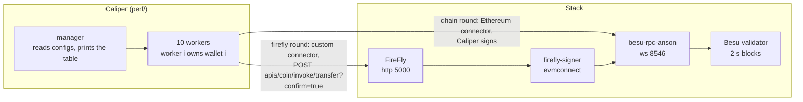

# Caliper in this project: how to run a performance test, step by step

This guide shows how to measure this stack with [Hyperledger Caliper](https://github.com/hyperledger-caliper/caliper), the way `perf/` does it: the same `COIN.transfer` sent **straight to Besu** and sent **through FireFly**, so the difference between the layers is visible. Everything here is read from `perf/` and `docs/perf-results.md`; the numbers it quotes were measured on this stack (2026-10-04) and describe this demo, not Besu's or FireFly's limits. Where a point was not run, it is marked **(not run)**.

**Contents:** [1. What Caliper is](#1-what-caliper-is) · [2. How it is wired here](#2-how-it-is-wired-here) · [3. Step by step](#3-step-by-step) · [4. Reading the results](#4-reading-the-results) · [5. Changing the load](#5-changing-the-load) · [6. Writing your own benchmark](#6-writing-your-own-benchmark) · [7. When something fails](#7-when-something-fails)

---

## 1. What Caliper is

Caliper is a load generator for blockchains. You give it three things and it reports throughput and latency:

| You give it | Meaning | File in this project |
|---|---|---|
| **Network config** | How to reach the system under test (URL, keys, contract) and which connector to use | `perf/generated/ethereum.json`, `firefly.json` |
| **Benchmark config** | The rounds: how many transactions, at what rate, which workload module | `perf/generated/benchmark-chain.yaml`, `benchmark-firefly.yaml` |
| **Workload module** | JavaScript that builds each request | `perf/workload/transfer.js` |

A **manager** process reads the configs and starts **workers**. Each worker runs the workload module and sends requests through a **connector** (the adapter for one kind of system). Caliper has an Ethereum connector but no FireFly connector, so this project adds a small one (`perf/connector/firefly-connector.js`).

Terms used below:

| Term | Meaning |
|---|---|
| **Round** | One measured run with a fixed number of transactions and a rate |
| **TPS offered** | The rate Caliper tries to send (`fixed-rate`). Not the same as throughput |
| **Throughput** | Transactions that finished per second, as Caliper measured |
| **Latency** | Time from sending a transaction to its confirmation |
| **SUT** | System under test: here Besu, or Besu behind FireFly |

---

## 2. How it is wired here



- **Same workload, two paths.** `workload/transfer.js` is one module used by both rounds. Worker `i` sends `COIN.transfer(wallet[i+1], amount)` from its own wallet, and the last worker sends to the first, so every recipient is a verified investor (a `COIN` transfer to anyone else is refused).
- **Chain round.** Caliper's Ethereum connector signs with a key derived from a seed and sends over WebSocket (`ws://localhost:8546`; the connector refuses `http`). It waits for one confirmation block.
- **FireFly round.** The custom connector calls FireFly's contract API with `confirm=true`, so the request returns only when the operation is final. A transaction counts as successful **only if FireFly reports the operation `Succeeded`**.
- **Two sets of wallets.** `perf-setup --wallets N` prepares `2N` wallets: the first `N` for the chain round, the next `N` for the FireFly round. FireFly's evmconnect tracks each key's nonce from its own records; a key also used directly by the chain round would make it fail with `Nonce too low`.
- **The token is already deployed**, so Caliper runs with `--caliper-flow-skip-install` (and `skip-start`, `skip-end`: Caliper does not start or stop the stack, Docker does).

---

## 3. Step by step

Run from the repository root unless a step says otherwise. You need Docker, Python 3.11+ with `pip install -e ".[dev]"`, and Node 18.19+.

### Step 1. Bring up a clean stack

```bash
python scripts/stack.py reset
python scripts/stack.py up
python scripts/stack.py deploy
```

Start from `reset` so that earlier runs, extra mints or pending FireFly operations do not distort the numbers. `deploy` writes `deployed-addresses.json`, which holds the `COIN` address Caliper needs. (Or: `docker compose up -d` then `docker wait deployer`, which prints `0` on success.)

*Check:* `docker compose ps` shows the Besu and FireFly containers healthy, and `deployed-addresses.json` has a `token` entry.

### Step 2. Install the contract packages

```bash
cd contracts && npm ci && cd ..
```

Caliper needs `COIN`'s ABI, and `perf/lib/prepare.js` reads it from the pinned T-REX package in `contracts/node_modules`. Without it the round stops with `Run npm ci in contracts/ first`.

### Step 3. Install Caliper

```bash
cd perf
npm ci
npm install --no-save web3@1.3.0
```

- Caliper is pinned to **0.6.0**; 0.7.1 has no Ethereum connector.
- `web3@1.3.0` is installed by hand because `caliper bind` fails on Windows (`spawn EINVAL`), and installing that package is all `bind` would do. `--no-save` keeps it out of `package.json`.
- Caliper's dependencies are old and deprecated; that is accepted for a local demo.

*Check:* `npm test` passes (unit tests of the report parser, the snapshot and the connector rules; no stack needed).

### Step 4. Prove Caliper can reach the token (smoke test)

```bash
npm run smoke
```

This runs a **read-only** `COIN.name()` round (10 calls, 5 TPS, one worker) with the admin key and writes `report.html`. If it works, the URL, the ABI and the address are right. It sends no transaction, so it is safe to repeat.

### Step 5. Prepare the benchmark wallets

Back in the repository root:

```bash
python scripts/stack.py perf-setup --wallets 10 --coins 100
```

This derives `2 x 10` wallets from the seed, makes each a verified investor (OnchainID, identity registry entry, KYC claim) and mints 100 COIN to each, all through FireFly. It only does what is missing, so a second run sends nothing. It took 162 to 212 s in the measured runs, longer than the two rounds together.

`--wallets` must equal `PERF_WALLETS` in the next steps (default 10 for both).

> Setup **mints COIN**, which changes `totalSupply`. Run `python scripts/stack.py reset` after benchmarking, before the integration tests.

### Step 6. Run the chain-layer round

```bash
cd perf
npm run round:chain
```

What `run.js chain` does:

1. Reads the load from `PERF_*` (section 5) and rewrites `generated/` (token address, ABI, network configs, benchmark files).
2. Waits until FireFly has no pending operations left from an earlier round (up to 180 s).
3. Checks that each wallet is a verified investor and holds enough COIN, and says which `perf-setup` command to run if not.
4. Runs Caliper (`caliper launch manager ...`) and prints its summary table.
5. Reads the table into numbers, checks that **the sum of the wallets' balances is the same before and after** (the transfers only moved COIN), and writes `results/chain.json` and `results/chain-report.html`.

The round **fails (non-zero exit)** if any transaction failed, if the count is not what was offered, or if the balance sum changed.

### Step 7. Run the FireFly-layer round

```bash
npm run round:firefly
```

Same steps, with the custom connector, wallets `N` to `2N-1`, and `results/firefly.json` and `results/firefly-report.html`. The two rounds can run in any order and be repeated, because they use separate wallets.

### Step 8. Read and compare

Open `results/chain-report.html` and `results/firefly-report.html` in a browser, or read the `summary` in the two JSON files. Section 4 explains each figure.

### Step 9. Clean up

```bash
cd .. && python scripts/stack.py reset
```

`perf/generated/` and `perf/results/` are not committed. To keep a result, copy the JSON (as `docs/perf-data/` does) before the next round overwrites it.

---

## 4. Reading the results

Caliper prints one row per round, which `perf/lib/report.js` parses:

```
| Name     | Succ | Fail | Send Rate (TPS) | Max Latency (s) | Min Latency (s) | Avg Latency (s) | Throughput (TPS) |
```

| Column | Meaning | What to look for |
|---|---|---|
| Succ / Fail | Transactions that confirmed / failed | Fail must be 0 for the number to mean anything |
| Send Rate | The rate Caliper actually sent at | Close to `PERF_TPS`; far below means the workers were the limit |
| Throughput | Finished transactions per second | Close to Send Rate means the system kept up; lower means it fell behind |
| Avg / Min / Max latency | Send to confirmation | Compare the two layers at the **same** offered load |

`results/<layer>.json` also carries the **snapshot**: workers, offered TPS, block period and gas limit from the genesis file, validator and RPC counts, and the Besu, FireFly, Caliper and Node versions. Keep it with the numbers, because a result without its configuration cannot be compared later.

**What the saved runs showed** (5 TPS offered, 300 transactions, 10 workers; two runs, from `docs/perf-results.md`):

| Layer | Throughput | Average latency |
|---|---|---|
| Chain | 5.1 TPS | 0.74 to 0.99 s |
| FireFly | 4.8 to 4.9 TPS | 4.63 to 4.92 s |

At this load both layers keep up, so the visible cost of FireFly is latency, about four seconds more per transfer. That page does not split the cause. Two runs of one configuration are not a distribution: expect run-to-run spread, and treat the 2 s block period as a floor under every confirmed transaction.

---

## 5. Changing the load

One place sets the load of both rounds, as environment variables (defaults in `perf/lib/params.js`):

| Variable | Default | Meaning |
|---|---|---|
| `PERF_WALLETS` | 10 | Wallets, and Caliper workers: worker `i` owns wallet `i` |
| `PERF_TPS` | 5 | Transactions per second offered **in all** |
| `PERF_TXS` | 300 | Transactions **in all**; must be a multiple of `PERF_WALLETS` |
| `PERF_AMOUNT` | `1000000000000000` | Base units per transfer (0.001 COIN at 18 decimals) |
| `PERF_SEED` | `besu-with-firefly perf demo seed` | Seed the wallets derive from; must match `src/core/perf/wallets.py` (a test checks this) |

Caliper takes `txNumber` and `tps` as totals and splits them across the workers: with 10 workers, `PERF_TPS=5` is 0.5 per worker.

Example, find where FireFly stops keeping up (PowerShell shown; in Git Bash use `PERF_TPS=8 PERF_TXS=480 npm run round:firefly`):

```powershell
$env:PERF_TPS = "8"; $env:PERF_TXS = "480"; npm run round:firefly
```

Rules of thumb:
- **Each wallet needs `PERF_AMOUNT x (PERF_TXS / PERF_WALLETS)` COIN.** The default needs 0.03 COIN, far below the 100 COIN that `perf-setup` gives. The runner checks this before it starts.
- **More wallets than 10** needs `perf-setup --wallets N` with the same N, and `PERF_WALLETS=N`.
- **Raising `PERF_TPS`** is how you find the ceiling. On this setup the FireFly layer takes about 8 TPS before evmconnect's submissions time out: at `PERF_TPS=20` with 600 transactions, one run gave 145 succeeded and 455 failed with an average latency of 67.7 s, while the chain layer took the same 20 TPS (19 TPS, 1.86 s). That was one run. A round past the ceiling exits non-zero and says why, which is the signal you have found it, not a bug.
- **Run long enough.** Under a minute of load (the default is about 60 s) is short; for a steadier figure raise `PERF_TXS` with `PERF_TPS` so a round lasts several minutes.

---

## 6. Writing your own benchmark

Say you want to measure `mint`, or a read, or a Noto transfer **(not run: the files below cover only `COIN.transfer` and `COIN.name`)**. The pieces to change:

1. **A workload module** in `perf/workload/`, modelled on `transfer.js`. It extends `WorkloadModuleBase`; `initializeWorkloadModule` runs once per worker (choose its sender and recipient from `workerIndex`), and `submitTransaction` runs once per transaction and returns `this.sutAdapter.sendRequests({...})`. The request fields:

   | Field | Used by | Meaning |
   |---|---|---|
   | `contract`, `verb`, `args` | Ethereum connector | Which contract, method and positional arguments |
   | `sender`, `inputs` | FireFly connector | Signing key and the named arguments (`{ _to, _amount }`) |
   | `readOnly` | both | `true` for a query, `false` for a transaction |

2. **A benchmark entry** in `lib/prepare.js` (`benchmarkYaml`) or a static file like `benchmarks/smoke.yaml`: `txNumber`, a `rateControl` (`fixed-rate` with `tps` is what is used here; Caliper also has others, such as `fixed-load`, **not run here**) and `workload.module`.
3. **Preconditions.** Anything the workload needs on chain (identities, balances, allowances) must exist before the round. That is what `perf-setup` does for `transfer`, and why the runner checks it first rather than letting the round fail halfway.
4. **Do not let the two layers share a sender** (section 2).
5. **Check what "success" means.** On the FireFly layer it is the operation reaching `Succeeded` (`lib/firefly-status.js`); a request that only got accepted does not count. Keep the same bar if you add a layer.

Keep new logic in `perf/lib/` with a test in `perf/test/`, as the existing parser and snapshot have, and run `npm test`.

---

## 7. When something fails

| You see | Likely reason | What to do |
|---|---|---|
| `deployed-addresses.json not found` or no `token` entry | `deploy` has not run | `python scripts/stack.py deploy` |
| `Run npm ci in contracts/ first` | The T-REX package is missing | `cd contracts && npm ci` |
| `wallet 0x... is not ready (verified: ..., balance: ...)` | `perf-setup` has not run, or ran with a different `--wallets` | `python scripts/stack.py perf-setup --wallets N` (the message prints it) |
| `FireFly still has pending operations after 180 s` | An earlier round left operations queued | Wait, or `python scripts/stack.py reset` |
| `Nonce too low` on the FireFly round | A FireFly-layer wallet was also used directly | Use the separate sets; `reset` and set up again if mixed |
| Many failures and latency of tens of seconds | The offered TPS is above the FireFly ceiling | Lower `PERF_TPS` (default 5), or treat it as the ceiling measurement |
| `PERF_TXS (...) must be a multiple of PERF_WALLETS (...)` | Each worker sends the same number | Fix the two variables |
| `the sum of the wallets' balances changed` | Something other than the benchmark moved COIN | `reset`, run `perf-setup`, run again |
| `caliper bind` fails with `spawn EINVAL` (Windows) | Known Caliper issue | Do not run `bind`; use `npm install --no-save web3@1.3.0` |
| Connector refuses the URL | Ethereum connector needs `ws://` | Keep `ws://localhost:8546` in the network config |
| Integration tests fail after benchmarking | The benchmark minted COIN | `python scripts/stack.py reset` |

See also: [perf-results.md](perf-results.md) for the measured numbers and their limits, and [../perf/README.md](../perf/README.md) for the short command reference.
