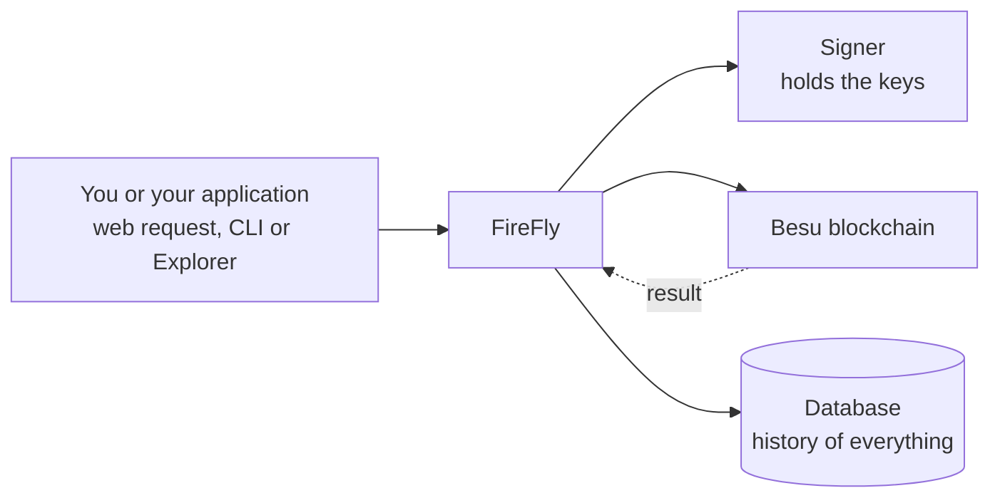
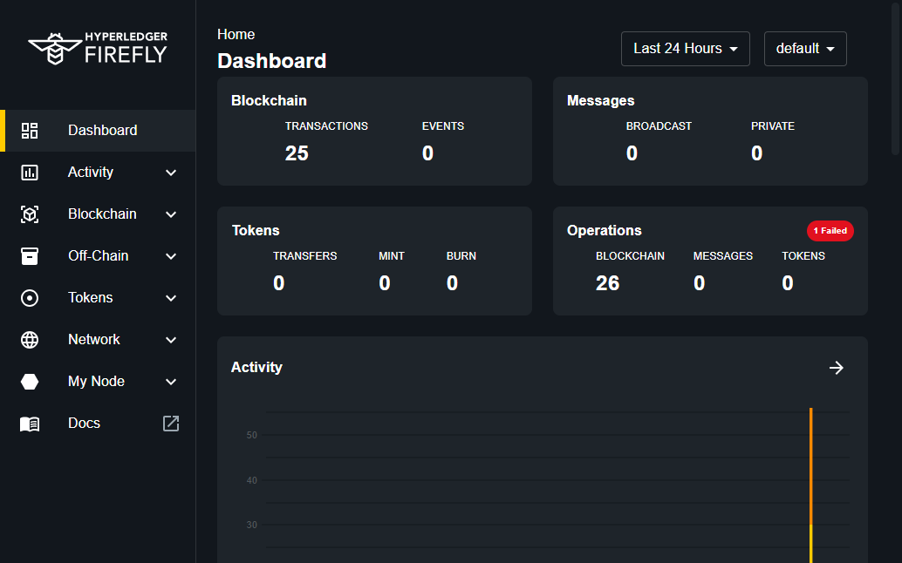
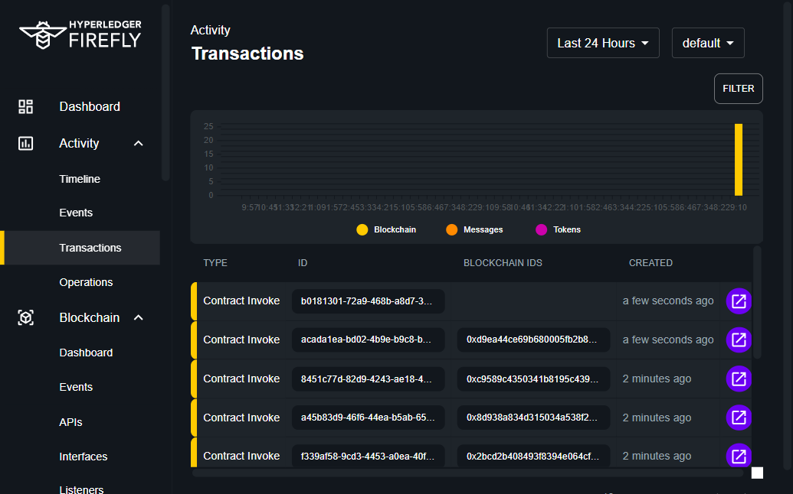
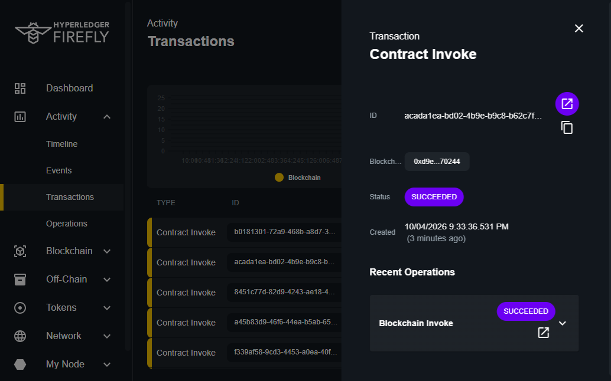
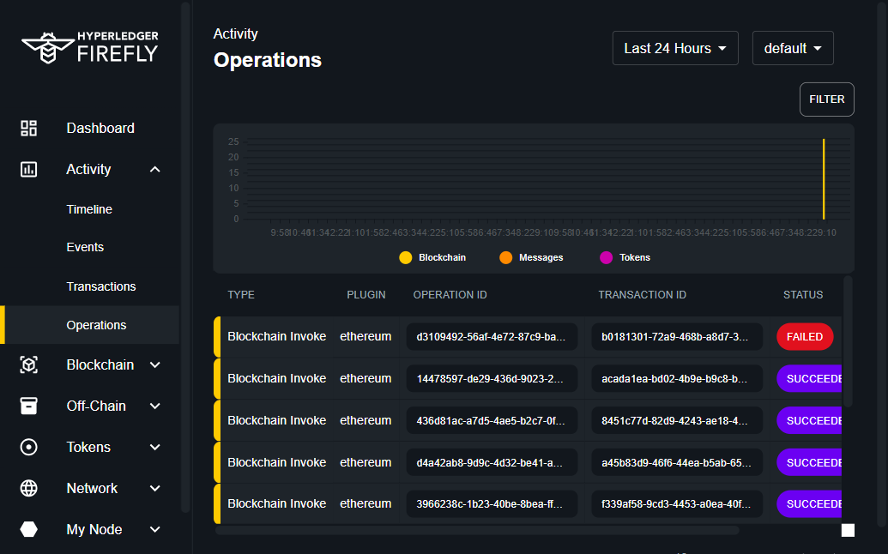
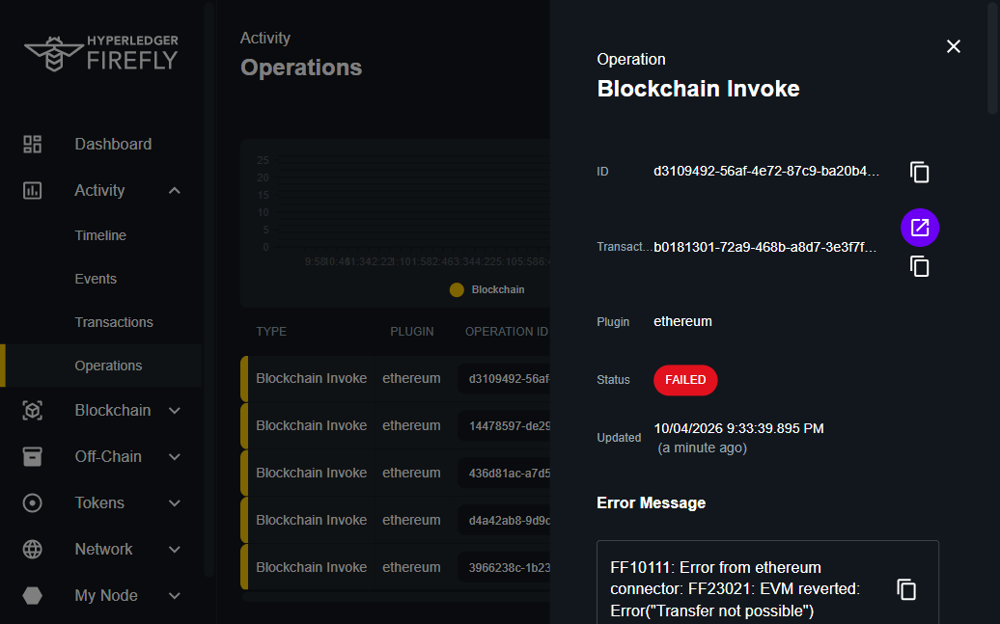
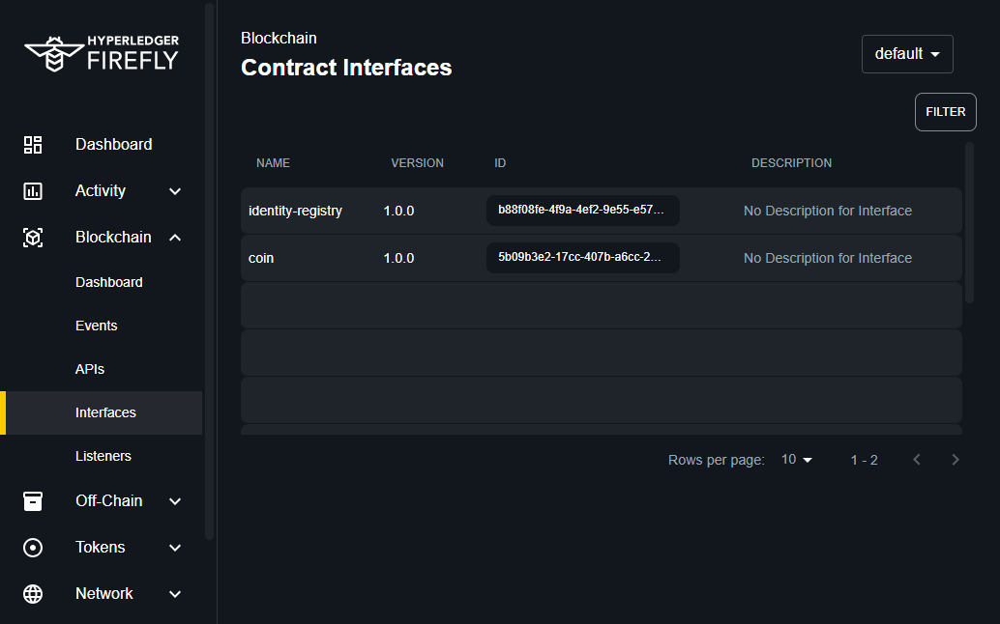
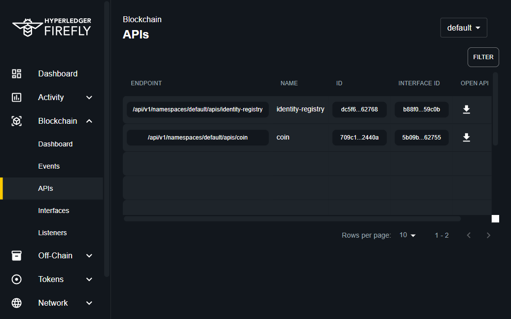
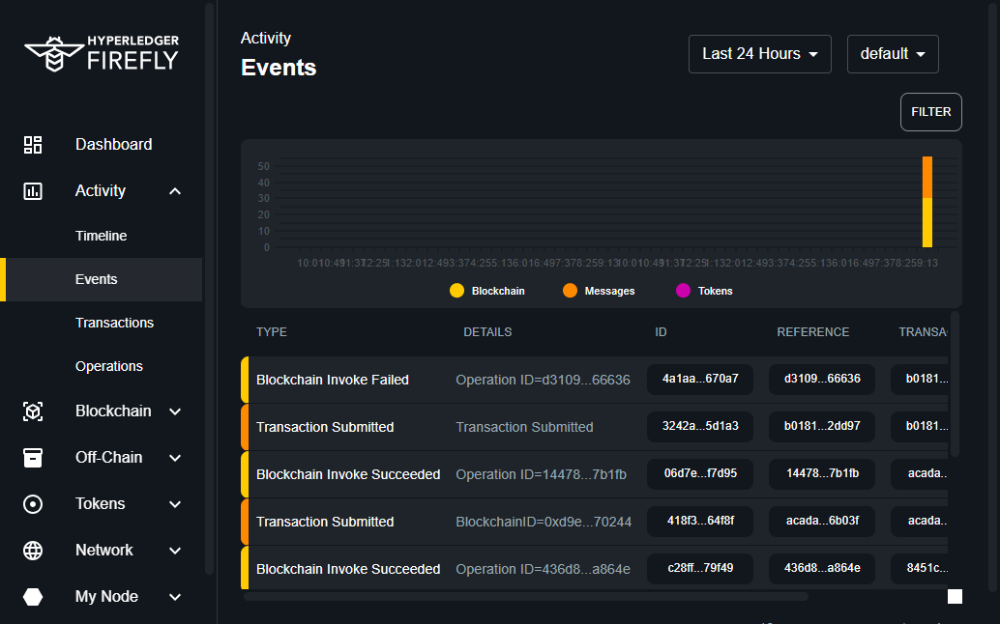

# FireFly user guide for beginners

This guide teaches what Hyperledger FireFly does in this project and how to use it from its web page, the **FireFly Explorer**. You need no blockchain background. Every screen described here was opened on the running demo stack, and the screenshots come from it.

> The screenshots show demo data: the demo wallets and the transactions made by `python scripts/stack.py deploy` plus one successful and one refused transfer. Your ids and times will differ.

**Contents:** [1. What FireFly is](#1-what-firefly-is-in-plain-words) · [2. Open the Explorer](#2-open-the-explorer) · [3. A tour of the screens](#3-a-tour-of-the-screens) · [4. Try it: four walkthroughs](#4-try-it-four-walkthroughs) · [5. Words you will see](#5-words-you-will-see) · [6. Pages that are empty here, and why](#6-pages-that-are-empty-here-and-why) · [7. When something looks wrong](#7-when-something-looks-wrong) · [8. Going further](#8-going-further)

---

## 1. What FireFly is, in plain words

A blockchain is a shared ledger. Talking to one directly is awkward: you must build a transaction, sign it with a private key, send it, wait for it to be included in a block, and then read the result. FireFly is a gateway that does all of that for you. Your application makes an ordinary web request ("transfer 25 coins from Anson to Beatrice"), and FireFly:

1. **signs** the transaction with the right key, held by its signer (not by your application);
2. **sends** it to the blockchain (here, the Besu network of this project);
3. **tracks** it, so you can always ask "did it work?";
4. **records** what happened, as events you can browse;
5. **generates a ready-made web API** for any smart contract you register, so you never write raw transactions.



### What FireFly can do, and what this project uses

FireFly has several feature families. This project runs it in **gateway mode**: one FireFly in front of one blockchain, with only the blockchain and database plugins.

| Feature | What it is for | Used here? | Where you see it in the Explorer |
|---|---|---|---|
| **Contract interfaces and APIs** | Register a smart contract once and get a documented web API for its functions | **Yes**: `coin` (the token) and `identity-registry` | Blockchain > Interfaces and APIs |
| **Transactions and operations** | Send a write to the chain and follow it until it succeeds or fails | **Yes**: every transfer, deployment and onboarding step | Activity > Transactions and Operations |
| **Events** | A log of what happened (a write succeeded, a contract was registered) | **Yes** | Activity > Events and Timeline |
| **Contract listeners** | Subscribe to events a smart contract itself emits | Available, none registered | Blockchain > Listeners |
| **Contract deployment** | Deploy a smart contract through FireFly | **Yes**: the token suite is deployed this way | Activity > Transactions (type Contract Deployment) |
| **Token pools and transfers** | Manage tokens through a token plugin | Not configured: `COIN` is used through its contract API instead | Tokens |
| **Private and broadcast messaging, shared data** | Exchange data between organisations, with only a hash on chain | Not used (this needs a multiparty network) | Off-Chain |
| **Network identities** | Organisations and nodes of a multiparty network | Not used | Network |
| **Subscriptions and WebSockets** | Let an application receive FireFly's events live | Available | My Node |

---

## 2. Open the Explorer

1. Start the stack and deploy. The quick way, which needs only Docker, is `docker compose up -d` followed by `docker wait deployer` (it prints `0` when the deploy has finished); the README's "quick route" explains it. The step-by-step way is `python scripts/stack.py up`, then `python scripts/stack.py deploy` (README steps 4 and 5).
2. Open **http://localhost:5000/ui** in a browser.

There is **no login**. This demo has no authentication and its ports are reachable only from your own machine. A real deployment would put a login in front (see [production-step-by-step.md](production-step-by-step.md)).

The page you land on is the **Dashboard**:



Two controls at the top right matter everywhere:
- **Last 24 Hours** is a time filter. If a list looks empty, widen this first.
- **default** is the *namespace*, FireFly's way of keeping separate sets of data apart. This project uses only `default`.

The left menu has seven entries. Most expand into sub-pages:

| Menu | Sub-pages | Use it to |
|---|---|---|
| **Dashboard** | | See totals and the most recent activity |
| **Activity** | Timeline, Events, Transactions, Operations | Follow what was sent and what happened to it |
| **Blockchain** | Dashboard, Events, APIs, Interfaces, Listeners | See the registered contracts and their APIs |
| **Off-Chain** | Dashboard, Messages, Data, Batches, Datatypes, Groups | Messaging and shared data (not used here) |
| **Tokens** | Dashboard, Transfers, Pools, Balances, Approvals | Token plugin features (not used here) |
| **Network** | Dashboard, Organizations, Nodes, Identities, Namespaces | The multiparty network (not used here) |
| **My Node** | Dashboard, Subscriptions, WebSockets | This FireFly's own connections |
| **Docs** | | Opens the official FireFly documentation |

Every page has a **FILTER** button for narrowing a list, and clicking a row (or its small *open* icon) opens a detail panel on the right. The address in your browser changes to include `slide=<id>` when a panel is open, so you can **copy that link to share exactly what you are looking at**.

---

## 3. A tour of the screens

### The dashboard

The four cards give the totals for the chosen time range:
- **Blockchain**: transactions sent through FireFly, and blockchain events received.
- **Messages**: broadcast and private messages (always 0 here).
- **Tokens**: token transfers, mints and burns of FireFly's token feature (always 0 here; see section 6).
- **Operations**: the individual steps behind transactions. A red badge such as **1 Failed** tells you something was refused or broke, and clicking it opens **Activity > Operations** already filtered to the failed ones.

Below them are an activity chart, a picture of **My Node** (the FireFly core with its `ethereum` blockchain and `postgres` database connections), the **recently submitted transactions**, and **recent network events**.

### Activity > Transactions

A **transaction** is one thing you asked FireFly to do, such as "invoke this contract function" or "deploy this contract".



The columns are the **type** (for example Contract Invoke or Contract Deployment), the transaction **ID**, the **Blockchain ID** (the transaction hash on the chain) and when it was **created**. A row with no Blockchain ID, like the top one above, never reached the chain: it was refused before it was mined (the walkthrough in section 4 explains this one).

Click a row to see the transaction:



You get its ID and Blockchain ID, its **status** (here SUCCEEDED), when it was created, and the **operations** it consists of, each of which you can open.

### Activity > Operations

An **operation** is one concrete step FireFly performs for a transaction, such as "send this to the blockchain". A transaction has one or more operations, and the operation's status is the one to watch.



The **Status** column is the quickest way to see a problem: purple **SUCCEEDED**, red **FAILED**.

### A failed operation tells you why

Click the red row:



The panel shows the operation's ID, the transaction it belongs to, the plugin (`ethereum`), the status, when it was last updated, and the **Error Message**:

```text
FF10111: Error from ethereum connector: FF23021: EVM reverted: Error("Transfer not possible")
```

Read it from the end: `EVM reverted: Error("Transfer not possible")` means **the smart contract itself refused the request**, and the text in quotes is the contract's own reason. In this project that message means the recipient is not a verified investor, so the token will not move.

### Blockchain > Interfaces and APIs

An **interface** describes a smart contract: the functions it offers and their inputs. An **API** is what FireFly builds from an interface plus the address of one deployed contract: a set of web endpoints, one for each function.





This project has two of each: **`coin`** (the ERC-3643 token) and **`identity-registry`** (the list of verified investors). The API page shows each API's **endpoint**, for example `/api/v1/namespaces/default/apis/coin`, and the download icon under **OPEN API** gets its machine-readable description. The next section shows how to try the API in a browser.

---

## 4. Try it: four walkthroughs

### Walkthrough 1: watch a transfer happen

You need the stack deployed and the `besu-ff` command installed (README step 2).

1. In a terminal, send 25 COIN from Anson to Beatrice:
   ```bash
   besu-ff invoke transfer --contract coin --as anson --input _to=@beatrice --input _amount=25000000000000000000
   ```
   It prints an **operation id** and a **transaction id**; copy the operation id.
2. In the Explorer, open **Activity > Transactions**. The newest **Contract Invoke** is yours, with a Blockchain ID.
3. Open **Activity > Operations**. The newest **Blockchain Invoke** is SUCCEEDED.
4. Open **Activity > Events**. FireFly logged `Transaction Submitted` and then `Blockchain Invoke Succeeded` for the same transaction (the **Reference** column holds the transaction or operation id):

   
5. To jump straight to your operation, put its id in the address: `http://localhost:5000/ui/namespaces/default/activity/operations?time=24hours&slide=<operation id>`.

The terminal's `besu-ff tx <operation id>` shows the same facts as text.

### Walkthrough 2: find out why a transfer was refused

1. In a terminal, send to Admin, who is not a verified investor:
   ```bash
   besu-ff invoke transfer --contract coin --as anson --input _to=@admin --input _amount=10000000000000000000
   ```
   It answers `refused by the contract: Transfer not possible` and exits with an error.
2. On the **Dashboard**, the **Operations** card now shows a red **1 Failed** badge. Click it, or open **Activity > Operations** and click the red row.
3. Read the **Error Message** as in section 3. The `EVM reverted` text tells you the contract said no, not FireFly or the network.
4. In **Activity > Transactions**, the same attempt is the row with **no Blockchain ID**: the contract refused it while FireFly was checking it, before anything was mined, so nothing moved.

### Walkthrough 3: see which contracts are registered, and try one

1. Open **Blockchain > Interfaces**, then **Blockchain > APIs**.
2. Open the generated API documentation in your browser: **http://localhost:5000/api/v1/namespaces/default/apis/coin/api** (it takes a moment to load). This is an interactive page (Swagger UI) titled `coin`, listing the token's functions as `/invoke/<function>` for writes and `/query/<function>` for reads.
3. Find the read `POST /query/name`, choose **Try it out**, and **Execute**. A *query* only reads, and the answer is `Coin`.
4. Try `balanceOf`. It needs a `_userAddress`. The demo wallet addresses are in `network-config/wallets.json`; use Anson's. The answer is a balance in the token's smallest unit (18 decimals), so `1000000000000000000000` is 1000 COIN.

A **query** reads and changes nothing. An **invoke** writes: it sends a real transaction on the demo chain, needs a signing wallet in its `key` field, and shows up in Transactions. Use the Swagger page for queries freely, and for invokes only when you mean to move something.

### Walkthrough 4: check that FireFly itself is healthy

1. Look at the **My Node** card on the home Dashboard. It draws FireFly core connected to its `ethereum` blockchain connection and its `postgres` database. (The **My Node** menu entry also has Subscriptions and WebSockets pages for applications that receive FireFly's events live.)
2. For a quick check outside the Explorer, open **http://localhost:5000/api/v1/status** in a browser. It answers with the node's namespace and plugins as JSON.
3. If something is missing, see section 7.

---

## 5. Words you will see

| Word | Meaning |
|---|---|
| **Namespace** | A separate set of FireFly data. This project uses `default` only. |
| **Transaction** | One thing you asked FireFly to do. |
| **Operation** | One step FireFly performs for a transaction (for example, sending it to the chain). Watch its status. |
| **Event** | A log entry of something that happened. |
| **Contract interface** | The description of a smart contract's functions (FireFly calls it an FFI). |
| **Contract API** | The web API FireFly builds from an interface and a contract address. |
| **Contract listener** | A subscription to events that a smart contract emits. None are registered here, so **Blockchain > Events** stays at 0. |
| **Invoke** | A call that writes to the chain. It is signed, takes a few seconds (one block), and can fail. |
| **Query** | A call that only reads. It is immediate and changes nothing. |
| **Key** | The wallet address that signs an invoke. FireFly's signer holds the private key; you only name the address. |
| **Blockchain ID** | The transaction hash on the chain. It exists only once the transaction was sent to the chain. |
| **Revert** | The contract refused the call. The message includes the contract's own reason. |

**Statuses.** An operation is **Pending** while FireFly is still working on it (it can stay so if the chain is slow), then **Succeeded** or **Failed**. Only Succeeded means it is done. A write that you cannot confirm should be treated as unknown, not as failed: look it up here before sending it again.

**Event names you will meet** on the Dashboard and in Activity > Events: `Transaction Submitted`, `Blockchain Invoke Succeeded`, `Blockchain Invoke Failed`, `Contract Deployment Succeeded`, `Contract Interface Confirmed`, `Contract API Confirmed`.

---

## 6. Pages that are empty here, and why

Do not worry if these show **No ... to Display** or zeros: it is expected in this setup.

- **Off-Chain** (messages, data, batches, groups) and the **Messages** card: FireFly's private and broadcast messaging needs a *multiparty* network of several organisations. This project runs FireFly in gateway mode.
- **Network** (organisations, nodes, identities): the same reason. The Organizations page says "No Organizations to Display".
- **Tokens**: FireFly's own token feature needs a token plugin, which is not configured. The `COIN` token is used through its contract API instead, so its transfers appear under **Activity**, not under Tokens.
- **Blockchain > Listeners** and **Blockchain > Events**: no contract listener is registered, so no contract events are collected.

---

## 7. When something looks wrong

| What you see | Likely reason | What to do |
|---|---|---|
| The page does not load, or stays blank | The stack is not running, or FireFly is still starting | Run `python scripts/stack.py up` and wait for every container to be healthy; check http://localhost:5000/api/v1/status |
| A list is empty but you know you sent something | The time filter or the namespace | Widen **Last 24 Hours**, and check the namespace says `default` |
| Everything is empty after you ran `reset` | `reset` wipes FireFly's database with the chain | Run `up` and `deploy` again; the history starts from zero |
| A red **FAILED** operation | The contract or the chain refused the request | Open it and read the **Error Message** (section 3) |
| An operation stays **Pending** for a long time | The chain is slow or FireFly cannot reach its connector | Wait, check the containers, and look at the operation again; do not send the same write twice until you know |
| `Nonce too low` in an error | A wallet was used through another path as well as through FireFly | Use a wallet through FireFly only; see the Phase 5 notes in [spike-results.md](spike-results.md) |

---

## 8. Going further

- **Do the same from a terminal**: the README shows the `besu-ff` commands (`query`, `invoke`, `tx`, `register`), which call the same FireFly APIs the Explorer shows.
- **See the whole API**: **http://localhost:5000/api** is FireFly's own Swagger page for everything it can do.
- **Official documentation**: the **Docs** entry at the bottom of the Explorer's left menu opens it.
- **How this stack is built and what each demo shows**: [architecture.md](architecture.md), [deliverables.md](deliverables.md) and the README.
- **What running this for real would involve**: [production-step-by-step.md](production-step-by-step.md).
