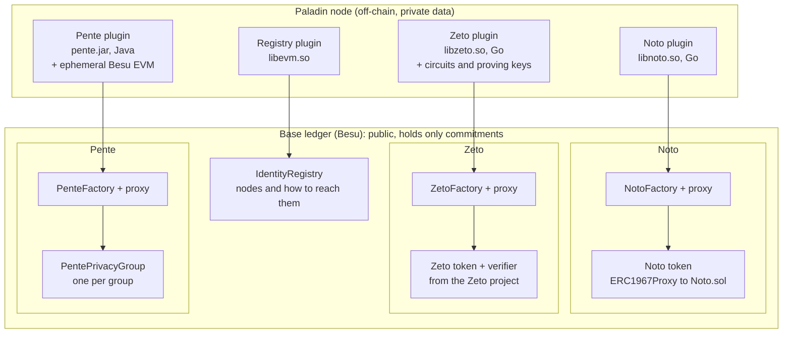
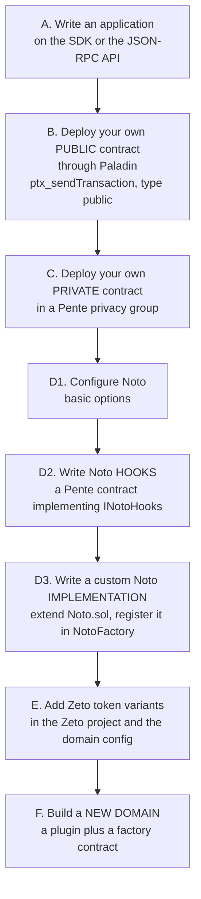
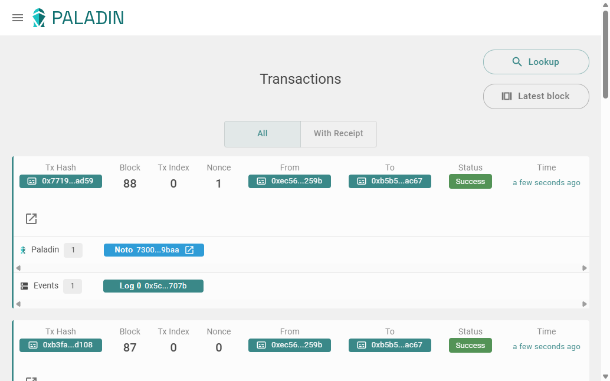

# Paladin's three domains: Noto, Zeto and Pente

What each one is, how they differ, which smart contracts each one uses, and how you can build your own contracts on top of them, or replace parts of them.

> **How much of this was run here.** This project runs **Noto only** (`docs/paladin-guide.md`). Everything about Zeto and Pente, and about extending Paladin, comes from reading the Paladin v1.0.0 source and documentation (the version this stack pins) and from inspecting the v1.0.0 image, not from running them. It is marked **(not run here)** where that matters. Where I could check a point on the live stack, it says so. Links point at the v1.0.0 tag, so they match the software in `docker-compose.yml`.

**Contents:** [1. Three building blocks](#1-three-building-blocks) · [2. Noto](#2-noto-notarized-tokens) · [3. Zeto](#3-zeto-zero-knowledge-tokens) · [4. Pente](#4-pente-private-evm-smart-contracts) · [5. The smart contracts side by side](#5-the-smart-contracts-side-by-side) · [6. Building custom smart contracts](#6-building-custom-smart-contracts-on-top) · [7. Replacing parts](#7-replacing-parts) · [8. Which one to choose](#8-which-one-to-choose) · [9. What this means for this project](#9-what-this-means-for-this-project) · [Sources](#sources)

---

## 1. Three building blocks

Paladin's own documentation frames privacy on a blockchain as three different approaches, each with a different answer to "who has to be trusted, and who sees what", and ships one **domain** for each. A domain is a plugin in the Paladin node that implements one kind of private logic, together with smart contracts on the base chain that anchor it.

| | **Noto** | **Zeto** | **Pente** |
|---|---|---|---|
| In one line | Tokens managed by one party, the **notary** | Tokens whose rules are enforced by **zero-knowledge proofs** | **Private EVM**: your own Solidity contracts in a **privacy group** |
| What it protects | Who owns what, and how much | Who owns what, and how much; the nullifier variants are built so a spend does not reveal which coin was spent (from the variant's design, not run here) | Everything a contract does and stores |
| Who enforces the rules | The notary (an identity at a node), then the chain checks the notary's signature and double-spends | Mathematics: a proof that the chain verifies, so no party has to be trusted | The members of the privacy group, who each execute and endorse; the chain checks their signatures |
| Who can see a transaction | The parties to it, and **the notary sees all** | The parties to it (the chain learns only commitments and a proof) | The members of the privacy group only |
| Fits | Regulated assets where an issuer or operator must legally see every transfer (bonds, funds) | Cash-like tokens where no one should be able to see or block a valid payment (digital cash, CBDC) | Business logic that must run privately between a known set of parties, and policy for the other two |
| Cost | Light: no cryptography beyond signatures | Heavy: generating a proof per transaction | Medium: the EVM runs in every member's node |
| Written in | Go | Go, plus circuits written in Circom | Java (it runs the Besu EVM as a library) |
| Shipped in the v1.0.0 image here | `/app/domains/libnoto.so` | `/app/domains/libzeto.so` and `/app/domains/zeto/zkp/` (circuits and proving keys) | `/app/domains/pente.jar` |
| Used by this project | **Yes** (Phase 3) | No | No |

The thread that ties them together is that all three are **UTXO-based** on the base ledger: the chain records salted hashes of states ("commitments") and checks that they are spent only once, and the real data stays in the Paladin nodes. Because they share one framework, a transaction that touches several of them can be made **atomic** (the same outcome on every leg or none), which is what lets one domain, such as a Pente contract, hold the business rules for tokens in another, such as Noto.

---

## 2. Noto: notarized tokens

**What it is.** Confidential UTXO tokens managed by a single party, the **notary**. Each coin is a private record with an owner, an amount and a random salt. On the chain it appears only as a hash. The base ledger provides the ordering and double-spend protection, the private data provides the record of who owns what.

**How a transfer goes.** The sender's node assembles the proposal (the coins it spends and the coins it creates) and sends it, signed, to the notary. The notary validates it and **submits the transaction to the blockchain itself**; the recipient receives the private data for its new coin and sees the chain's confirmation, as two separate things. In the official walkthrough a third party that later receives value learns nothing that says the first two ever dealt with each other.

**What the notary checks**, always (the library enforces it, so it cannot be changed without changing the code):
- **Request authenticity**: an EIP-712 signature from the sender.
- **State validity**: the inputs and outputs are a valid expression of the requested operation (a transfer spends only the sender's coins, creates the recipient's coin, and any remainder goes back to the sender).
- **Conservation of value**: inputs equal outputs, except for mint and burn.

**Two notary modes** (chosen when a token is created):

| Mode | What it is | Options |
|---|---|---|
| `basic` | The notary applies fixed rules. **This is what this project uses.** | `restrictMint` (default true: only the notary mints), `allowBurn` (default true), `allowLock` (default true). `unlock` by the lock's creator only; `burnFrom` and `transferFrom` always revert. |
| `hooks` | The notary calls a **private Pente contract** that you write, for every operation, and that contract decides | A privacy group, and the hook contract's public and private addresses. None of the `basic` limits apply: **the hook must enforce all policy**. |

**Operations** (the private ABI, `type: private` through `ptx_sendTransaction`): `constructor` (token creation: `notary`, `notaryMode`, optional `implementation` and `options`), `mint`, `transfer`, `transferFrom`, `burn`, `burnFrom`, `lock`, `unlock`, `prepareUnlock`, `delegateLock`, `balanceOf`.

**Locks and atomic settlement.** A holder can lock coins, prepare what should happen when they are unlocked, and delegate the lock to a smart contract. That contract can then complete the prepared outcome or roll it back directly on the chain, without the notary, because the notary already recorded the hash of the prepared transaction in the lock. This is the mechanism for delivery-versus-payment and payment-versus-payment across tokens and domains. (This project's Noto token contains the lock schemas, as the `pstate_listSchemas` output shows, but the demo never locks anything.)

**On-chain contracts** (all Apache-2.0, in `solidity/contracts/domains/noto/`):
- `Noto.sol`: one token. Its `transfer` and `mint` are `onlyNotary` and refuse a transaction id used before; it keeps which states are unspent, the locks, and is upgradeable by the notary only.
- `NotoFactory.sol`: creates tokens. It holds a `default` implementation and a registry of named implementations (`registerImplementation`, `getImplementation`, `deployImplementation`), and each new token is an `ERC1967Proxy` pointing at one of them, announced by the event `PaladinRegisterSmartContract_V0`.
- `NotoNullifiers.sol`: a **variant** of `Noto` (it extends it) that adds a sparse Merkle tree of commitments and a nullifier set, an example of an alternative implementation.
- Interfaces: `INoto`, `INotoPrivate` (the ABI you call), `INotoHooks` (what a hook contract implements: `onMint`, `onTransfer`, `onBurn`, `onLock`, `onUnlock`, `onPrepareUnlock`, `onDelegateLock`, and the lock-creating variants).

This project deploys, through `deploy`, the `registry`, `noto` (the implementation), `noto_factory` and `noto_factory_proxy`; the domain is configured with the **proxy** address and `factoryVersion` 2 (`docs/paladin-guide.md`, section 3.1).

---

## 3. Zeto: zero-knowledge tokens

**What it is.** A UTXO token toolkit where the rules are checked by **zero-knowledge proofs**, with the proof circuits written in Circom. The upside is that **no single party can see or block a valid transaction**, because the chain verifies the proof, not a trusted notary. The cost is the work of generating a proof for every transaction.

Zeto is a family of token implementations, each enforcing a policy through its circuits: conservation of value for fungible tokens, preservation of asset properties for non-fungible ones, KYC with privacy, and non-repudiation. The variants named in Paladin's documentation and its sample configuration:

| Variant | Adds |
|---|---|
| `Zeto_Anon` | Anonymous transfers |
| `Zeto_AnonEnc` | Encrypted values shared with the recipient |
| `Zeto_AnonNullifier` | Nullifiers, so a spend does not reveal which coin it spent |
| `Zeto_AnonNullifierKyc` | Nullifiers plus a KYC check in the circuit |

**What Paladin adds around it.** Because a UTXO balance is not stored in a contract, Paladin's runtime includes (from its documentation) a **tokens indexer** (it rebuilds balances from confirmed transactions), a **token selector** (it picks which coins to spend for an amount) and a **proof generator** (it uses the secrets only the node holds as private input to the circuit). The v1.0.0 image contains the circuits and proving keys under `/app/domains/zeto/zkp/` (`.wasm` circuits and `.zkey` files for `anon`, `anon_enc`, the nullifier and KYC variants, deposit and withdraw).

**Operations** (private ABI, implemented in Go): `constructor` (`tokenName`, one of the variants), `mint`, `transfer` (both take lists), `deposit` and `withdraw` (swap with a public ERC-20 at 1:1, so an issuer can control the supply publicly; mint is then normally disabled), `lockProof` (for coordinated DvP, so only a designated submitter can use a proof), `balanceOf` (limited to 1000 states, not a replacement for an indexer). The page also says `deposit` and `withdraw` arrive in later releases; the same page documents them, so check their availability in v1.0.0 before relying on them **(not run here)**.

**On-chain contracts.** `ZetoFactory.sol` (in `solidity/contracts/domains/zeto/`) creates fungible or non-fungible Zeto tokens by `tokenName`, and is built on `factory_upgradeable.sol` from the separate **Zeto** project (`@lfdecentralizedtrust/zeto-contracts`). The token contracts themselves and the proof verifiers live in that project, not in Paladin's repository. Its architecture is documented there.

**Configuration** (from the operator's sample, **not run here**): `plugin.type: c-shared`, `library: /app/domains/libzeto.so`, `allowSigning: true`, and a `config` that lists the implementations with their circuits and the prover's directories (`circuitsDir` and `provingKeysDir` pointing at `/app/domains/zeto/zkp`).

---

## 4. Pente: private EVM smart contracts

**What it is.** A way to run **your own Solidity (or Vyper) contracts privately** between a chosen set of parties. Where an ordinary chain has one world state that every contract shares and everyone can read, Pente gives **each contract its own world**, isolated, while the same shared ledger validates all of them.

**Privacy groups.** A privacy group is a set of members (identities on Paladin nodes). Each group is **one smart contract on the base ledger**: `PentePrivacyGroup.sol`, created by `PenteFactory.newPrivacyGroup`. It behaves like a small blockchain hosted inside that contract: accounts, nonces and contract state are all UTXO states recorded under it. The contracts you deploy into the group exist only in the members' nodes.

**How a transaction runs.**
1. A member submits a transaction to the group (`pgroup_sendTransaction`, similar to `eth_sendTransaction`; to deploy a contract, leave out `to` and supply `bytecode`).
2. The transaction is **pre-executed** in an ephemeral in-memory EVM inside the Paladin runtime (Pente is written in Java and uses the **Besu EVM as a library**; no Besu node needs to sit beside Paladin, and the Bonsai state store is not used).
3. The group's members **endorse** the exact transaction and its result off-chain.
4. A normal EVM transaction goes to the base ledger calling the group contract's `transition` (or `approveTransition` and `transitionWithApproval` for approval flows), which **verifies the members' EIP-712 signatures on-chain** and records only masked commitments (salted hashes of the inputs and outputs). The base EVM is not modified.

**Why this is different from the older private-transaction systems** (Constellation, Quorum, Tessera). The older model recorded only the *inputs* by hash, so overlapping groups could drift into different versions of the same contract with no warning. Pente verifies the whole execution result on-chain and gives each group a unique contract, so there is one source of truth per group.

**Extras.** Private **messages** between members with no chain transaction (no ordering or non-repudiation, but no latency or gas), and an **external call** mechanism (`IPenteExternalCall`) that lets a private contract trigger a call on another contract as part of the same transaction, which is how it takes part in atomic settlement with token domains. The group is managed through the `pgroup_*` JSON-RPC methods.

**Configuration** (operator sample, **not run here**): `plugin.type: jar`, `library: /app/domains/pente.jar`, `class: io.kaleido.paladin.pente.domain.PenteDomainFactory`, `config: {}`.

---

## 5. The smart contracts side by side

All paths are in the Paladin repository at tag v1.0.0, under `solidity/contracts/`. "Base ledger" means the Besu chain.



| Domain | Contract (v1.0.0) | What it does |
|---|---|---|
| Noto | `domains/noto/Noto.sol` | One token: `mint` and `transfer` (notary only, each transaction id once), unspent-state tracking, locks, notary-only upgrade |
| Noto | `domains/noto/NotoFactory.sol` (+ `_V0`, `_V1`) | Creates tokens as proxies of a chosen implementation; `registerImplementation` adds named implementations |
| Noto | `domains/noto/NotoNullifiers.sol` | A `Noto` variant with a commitments tree and nullifiers |
| Noto | `domains/interfaces/INoto*.sol`, `INotoHooks.sol` | The token interfaces and the hook interface a custom notary contract implements |
| Zeto | `domains/zeto/ZetoFactory.sol` | Creates fungible or non-fungible Zeto tokens by name; the tokens and verifiers come from the Zeto project |
| Zeto | `domains/interfaces/IZetoFungible.sol`, `IZetoNonFungible.sol` | Interfaces |
| Pente | `domains/pente/PenteFactory.sol` | `newPrivacyGroup`: creates one group contract |
| Pente | `domains/pente/PentePrivacyGroup.sol` | One privacy group: `transition`, `approveTransition`, `transitionWithApproval`, `validateEndorsements` (EIP-712), upgrade approval |
| Pente | `domains/interfaces/IPente.sol`, `IPenteExternalCall.sol` | Interfaces, and the external-call event |
| Shared | `registry/IdentityRegistry.sol` | The EVM registry of nodes and their transport details (this project's `registry`) |
| Shared | `domains/interfaces/IPaladinContractRegistry.sol` | The event `PaladinRegisterSmartContract_V0` that every factory emits so nodes learn of a new contract |
| Shared | `shared/Atom.sol`, `AtomFactory.sol` | Atomic execution of several operations as one (the base for DvP and swaps) |
| Examples | `private/` (`BondTracker`, `BondSubscription`, `InvestorList`, `NotoTrackerERC20`, `Swap`, `NotoLocks`, `TickTock`, ...), `tutorials/` (`HelloWorld`, `Storage`) | Private contracts and tutorial contracts to learn from |

**What is actually on the chain** for each domain is small: the factory, the per-instance contract (a Noto token, a Zeto token, a privacy group), and for each transaction the commitments (salted hashes) and a signature or proof. In this project's own run, a Noto mint and transfer produced four logs with no readable amount or address.

---

## 6. Building custom smart contracts on top

Paladin lets you add your own contracts at several levels. They are listed from the least to the most invasive; use the first one that does the job.



### A. Build an application on Paladin

Use the TypeScript SDK (`@lfdecentralizedtrust/paladin-sdk`, in `sdk/typescript`) or the Go SDK (`sdk/go`), or call the JSON-RPC methods directly (`ptx_*`, `pgroup_*`, `pstate_*`, ...), exactly as `src/adapters/paladin*.py` does in this project. The repository's `examples/` folder has runnable scenarios: `helloworld`, `public-storage`, `privacy-storage`, `notarized-tokens`, `private-stablecoin`, `zeto`, `bond`, `swap`, `event-listener`.

### B. Your own public contract, deployed through Paladin

An ordinary Solidity contract on the base ledger, with Paladin handling the signing keys, submission and receipts. From the `public-storage` example:

```ts
const txId = await paladin.ptx.sendTransaction({
  type: TransactionType.PUBLIC,
  abi: storageJson.abi,
  bytecode: storageJson.bytecode,
  from: owner.lookup,        // for example owner@node1
  data: {},
});
const receipt = await paladin.pollForReceipt(txId, timeout);   // receipt.contractAddress
```

Later calls use `type: PUBLIC` with `function`, `to` and `data`. In this project the **FireFly** path already does this job for `COIN`, and either can deploy such a contract; use Paladin when the contract belongs next to private Paladin logic (for example the public side of a bond whose private side is in Pente).

### C. Your own private contract in a Pente privacy group

Create a privacy group of the parties, then deploy any Solidity contract into it. From the `privacy-storage` example:

```ts
const penteFactory = new PenteFactory(paladin1, "pente");
const group = await penteFactory.newPrivacyGroup({ members: [node1Verifier, node2Verifier] })
  .waitForDeploy(timeout);
const contractAddress = await group.deploy({ abi: storageJson.abi, bytecode: storageJson.bytecode })
  .waitForDeploy(timeout);
```

The contract and its state exist only on the members' nodes; the chain sees the masked transition. This is the route for **custom business logic** that must stay private (an order book, an investor list, a bond register). The `solidity/contracts/private/` folder has examples.

### D. Customise Noto

Three levels, again from simple to deep:

1. **Options of `basic` mode**: `restrictMint`, `allowBurn`, `allowLock`, set in the token's constructor. No code.
2. **Hooks** (`notaryMode: "hooks"`): write a private contract that implements `INotoHooks` and deploy it in a Pente group (visible only to the notary, or to others for observability). For each operation, the hook either emits `PenteExternalCall` carrying the prepared Noto transaction (allowed) or reverts (refused), so it can enforce any policy: an allow-list of holders, limits, jurisdiction rules, even mirroring the token as a private ERC-20. In `hooks` mode **none of the basic constraints apply**, so the hook must enforce every rule, including who may mint. The `bond` example (which creates its token with `notaryMode: "hooks"`), `NotoTrackerERC20.sol` (`contract NotoTrackerERC20 is INotoHooks, ERC20`) and `BondTracker.sol` (which extends it) are real hooks; `InvestorList.sol` (`is Ownable, ITransferPolicy`) is a ready example of an allow-list policy contract. This is the supported way to add rules, and it is how a compliance regime like this project's `COIN` rules could be expressed privately.
3. **A custom implementation**: `Noto.sol` is written to be extended (`transfer` and `mint` are `virtual`, and the internal `_processInput` and `_processOutput` are `virtual`), and `NotoNullifiers.sol` is exactly such a subclass. You write your own subclass, deploy it, then ask the factory's owner to `registerImplementation("my-noto", address)`, and create tokens with the constructor field `implementation: "my-noto"` (`deployImplementation` clones it). Two cautions: the on-chain configuration carries a `variant` number that the domain's Go library has to understand (the code comments point to `domains/noto/pkg/types/config.go`), so a subclass that only tightens constraints is the easy case, while one that changes what the data means needs matching changes in the Go domain code **(not run here)**; and the factory is owned by whoever deployed it, so registration is a governance step.

### E. Zeto variants

The set of Zeto token contracts and their circuits is part of the Zeto project and of the domain's configuration (`domainContracts.implementations`, each naming its circuits and whether it uses encryption, nullifiers or KYC). Adding a variant means the contract and circuits in the Zeto project, the generated proving keys in the node's `provingKeysDir`, and a new entry in the config. This needs cryptographic work (writing and trusting circuits) that the other levels do not, and is **not run here**.

### F. Build a new domain

When none of the above fits, you can add a domain of your own. The pieces:
- **A plugin** that implements the domain interface. A domain is loaded from a native shared library (`plugin.type: c-shared`, the Go route, with the helper packages in `toolkit/go/pkg/plugintk` and `toolkit/go/pkg/domain`) or from a Java archive (`plugin.type: jar` with a `class`, with `toolkit/java`). The messages between Paladin and a domain are defined as protobuf in `toolkit/proto/protos/to_domain.proto` and `from_domain.proto`. The official page on the domain lifecycle is marked as work in progress and points to those files, so expect to read code.
- **On-chain contracts**: a factory that emits `PaladinRegisterSmartContract_V0` when it creates an instance, and the instance contract that records your commitments. `SimpleDomain.sol` and `SimpleToken.sol` in `solidity/contracts/domains/componenttest/` (33 and 80 lines) are small examples used in Paladin's component tests.
- **Configuration**: a `domains.<name>` block with the plugin, the `registryAddress` (the factory or its proxy) and a domain `config`, as for Noto.

This is the right level for a genuinely new privacy technique, and the wrong level for a new token rule.

---

## 7. Replacing parts

"Replace" can mean several things; each has its own mechanism.

| To replace | How | Notes |
|---|---|---|
| **Noto's rules** for new tokens | A custom implementation registered in `NotoFactory` (6.D.3), or hooks (6.D.2) | Existing tokens keep their implementation; `Noto` instances are proxies upgradeable **by their notary only** (`_authorizeUpgrade` is `onlyNotary`) |
| **Noto itself** with another domain | Use Zeto or Pente for the new asset; remove or leave the `domains.noto` block in each node's config | A domain is a config key: nodes load only the ones configured, and each needs its factory contracts deployed first |
| **The factory** | Deploy a new factory (or proxy) and point `registryAddress` at it | The factories are upgradeable (UUPS, owner only), so upgrading in place is the alternative to replacing |
| **The node registry** | `registries.<name>` with `libevm.so` (the contract-based registry this project uses) or `libstatic.so` (a static registry, see the configuration reference) | Both ship in the v1.0.0 image |
| **The transport** | `transports.<name>` with `libgrpc.so` (gRPC with mutual TLS, as here) | The only transport in the image |
| **Signing keys** | `signingModules`: a plugin point for signing (the image has only an example library, `libexample.so`) | Whether it can front an HSM or KMS depends on the plugin you provide **(not run here)** |
| **RPC authentication** | `rpcAuthorizers` (the image has `libbasicauth.so`) | The demo has none; production needs it |
| **The UI** | `rpcServer.http.staticServers` | On by default in this project; see the note below |

**The Paladin UI.** The image contains a web UI (`/app/ui`), and the official documentation says each node serves it at `/ui` once it is enabled. **This project enables it on all three nodes by default**: the base config that `init` generates (`src/core/paladin/config.py`, committed in `network-config/paladin/`) has, under `rpcServer.http`:

```yaml
    staticServers:
      - enabled: true
        staticPath: /app/ui
        urlPath: /ui
        baseRedirect: /ui/
```

so it is on the same port as each node's RPC: **`http://localhost:8548/ui/`** (node1), `8648` (node2), `8748` (node3). `baseRedirect` sends `/ui` to `/ui/`, which matters because the page loads its assets by relative path and is blank without the trailing slash (checked: `/ui` answers 302 to `/ui/`, which answers 200, on all three nodes after a fresh `docker compose up`). It shows the node's transactions and events, the submissions and the node registry, and decodes the Noto transaction:



Both demo transactions (the mint and the transfer) were sent **from the same account**, nonces 0 and 1: the notary's, which is consistent with the Noto design in which the notary submits. To enable the UI on a Paladin node of your own, add those four lines under `rpcServer.http` in its config. [paladin-guide.md](paladin-guide.md), section 5.8, shows what node1 and node3 display.

---

## 8. Which one to choose

| If you need | Choose | Because |
|---|---|---|
| A regulated asset where an issuer or operator must see and approve every transfer, with others kept out | **Noto** | The notary is the legal party that holds the record; light and simple |
| Rules that go beyond the fixed notary checks (allow-lists, limits, mirroring to ERC-20) | **Noto in `hooks` mode** with a Pente hook | Policy lives in a contract you write, privately |
| Digital cash where no operator should see or veto a valid payment | **Zeto** | Proofs replace trust; the price is proof generation per transaction |
| Private multi-party business logic (a register, a negotiation, an order book) | **Pente** | General EVM, private to the group |
| An atomic settlement across several of these (delivery against payment) | A combination, using **locks** and an atomic contract | The domains are designed to compose |
| A new privacy technique | A **new domain** | Only when the three do not fit |

---

## 9. What this means for this project

- **Today**: Noto in `basic` mode, three nodes, one notary. Nothing here depends on Zeto or Pente.
- **To add Pente or Zeto alongside Noto** (a possible future phase, **not run here**), the work would be: vendor the factory and implementation artifacts from the v1.0.0 release as `contracts/paladin/` does for Noto (`pente_factory`, `zeto_factory`, and for Zeto the token and verifier artifacts), extend the bootstrap in `src/core/paladin/bootstrap.py` and `src/adapters/paladin_deploy.py` to deploy them and write the new `domains.pente` or `domains.zeto` block (the operator's samples above are the template), restart the nodes, and add a demo and tests beside `noto-demo`. Pente needs no extra files in the image; Zeto uses the circuits and keys already in the image and a larger config.
- **To express policy on the Noto token**, the first thing to try is `hooks` mode with a small Pente contract, which needs Pente anyway.
- **To use your own Solidity contracts**, level B (public, through Paladin or through FireFly as `COIN` is) needs nothing new; level C needs the Pente domain.
- **To observe any of this**, use the Paladin UI, which this project now enables on every node (see above), together with the JSON-RPC checks in `paladin-guide.md`.

I can turn any of these into a task list in the usual way if you want one.

---

## Sources

Paladin v1.0.0 (the version pinned in `docker-compose.yml`), repository `LFDT-Paladin/paladin`:

- Noto: [doc-site/docs/architecture/noto.md](https://github.com/LFDT-Paladin/paladin/blob/v1.0.0/doc-site/docs/architecture/noto.md)
- Zeto: [doc-site/docs/architecture/zeto.md](https://github.com/LFDT-Paladin/paladin/blob/v1.0.0/doc-site/docs/architecture/zeto.md) (and the separate [Zeto project](https://github.com/LFDT-Paladin/zeto))
- Pente: [doc-site/docs/architecture/pente.md](https://github.com/LFDT-Paladin/paladin/blob/v1.0.0/doc-site/docs/architecture/pente.md)
- Tokens and the three approaches: [doc-site/docs/concepts/tokens.md](https://github.com/LFDT-Paladin/paladin/blob/v1.0.0/doc-site/docs/concepts/tokens.md)
- Domain plugin lifecycle (work in progress): [doc-site/docs/architecture/domains.md](https://github.com/LFDT-Paladin/paladin/blob/v1.0.0/doc-site/docs/architecture/domains.md)
- Configuration reference: [doc-site/docs/administration/configuration.md](https://github.com/LFDT-Paladin/paladin/blob/v1.0.0/doc-site/docs/administration/configuration.md)
- User interface: [doc-site/docs/getting-started/user-interface.md](https://github.com/LFDT-Paladin/paladin/blob/v1.0.0/doc-site/docs/getting-started/user-interface.md)
- Contracts: [solidity/contracts/domains](https://github.com/LFDT-Paladin/paladin/tree/v1.0.0/solidity/contracts/domains) and [solidity/contracts/private](https://github.com/LFDT-Paladin/paladin/tree/v1.0.0/solidity/contracts/private)
- Domain configuration samples: [operator/config/samples](https://github.com/LFDT-Paladin/paladin/tree/v1.0.0/operator/config/samples) (`core_v1alpha1_paladindomain_noto.yaml`, `_pente.yaml`, `_zeto.yaml`)
- Examples: [examples/](https://github.com/LFDT-Paladin/paladin/tree/v1.0.0/examples) (`public-storage`, `privacy-storage`, `bond`, ...)
- Documentation site: <https://LFDT-Paladin.github.io/paladin/head>

Checked in this project: the contents of `lfdecentralizedtrust/paladin:v1.0.0` (`/app/domains`, `/app/registries`, `/app/transports`, `/app/ui`, `/app/rpcauth`, `/app/signingmodules`), the UI enablement above, and the Noto behaviour in `docs/paladin-guide.md`.
