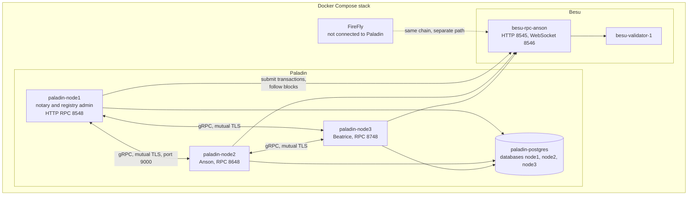
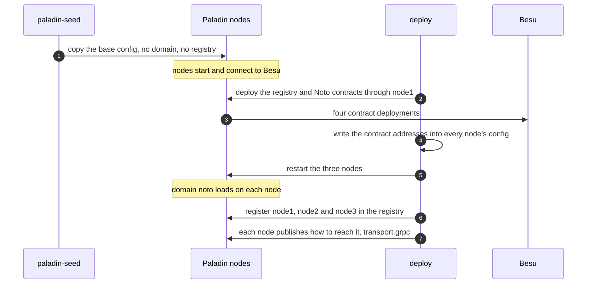
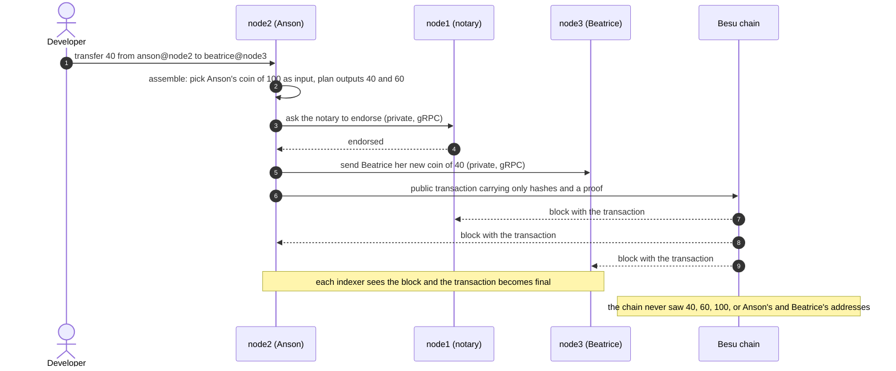

# Paladin in this project: what it does, how it fits in, how it works, and how to watch it

This guide explains Paladin through the way this repository uses it: a private token (Noto) on three Paladin nodes that share the project's Besu chain. What is stated as fact here was either read from the repository's own records (`docs/spike-results.md`, the code, the configs) or run on the live stack, and the commands in section 5 were all run. Where a point is about how Paladin works inside and was not checked in this project, it is marked **(verify)**.

**Contents:** [1. What Paladin is for](#1-what-paladin-is-for) · [2. How it is integrated here](#2-how-it-is-integrated-here) · [3. How it works](#3-how-it-works) · [4. Where it lives in the repository](#4-where-it-lives-in-the-repository) · [5. How to observe it](#5-how-to-observe-it-in-this-project) · [6. Limits of this setup](#6-limits-of-this-setup)

---

## 1. What Paladin is for

On a blockchain such as Besu, everything a smart contract does is visible to everyone who can read the chain. That is useful for the `COIN` token in this project (anyone can check that only verified investors hold it), but it is a problem when the amounts and the parties of a transfer should stay confidential.

**Paladin adds privacy to a blockchain you already run.** A Paladin node sits beside your chain node. It keeps the sensitive data (who owns what, how much) **off the chain**, in its own database, and shares each piece only with the parties that need it, directly node to node. The chain itself only receives opaque proofs and hashes, which is enough for everyone to agree that a transaction happened and in what order, without learning what it contained.

Paladin organises this as **domains**: each domain is a kind of private logic with its own rules. Paladin offers several; **this project uses only one, Noto.**

| | `COIN` (ERC-3643 through FireFly) | Noto token (through Paladin) |
|---|---|---|
| Who can see balances and transfers | Anyone who can read the chain | Only the parties to each transfer (and the notary) |
| Where the data lives | On the chain | In the Paladin nodes' databases; only hashes on the chain |
| Who enforces the rules | The smart contract itself (compliance and identity checks) | The **notary**, a named party that approves every transaction |
| Demo in this repo | `besu-ff invoke transfer ...` | `python scripts/stack.py noto-demo` |

The two are independent: Paladin does not use FireFly, and FireFly does not know about Noto. They share only the Besu chain.

### The words you need

| Word | Meaning here |
|---|---|
| **Node** | One Paladin server. There are three: `node1`, `node2`, `node3`. |
| **Domain** | A kind of private logic. Here: `noto`. |
| **Noto** | A private token. A **notary** approves every mint and transfer. |
| **Notary** | The party that endorses transactions. Here it is `notary@node1`, in `basic` mode. |
| **Coin (state)** | A private record of "this owner has this amount". Transfers spend coins and create new ones. |
| **Identity locator** | `name@node`, for example `anson@node2`: the name `anson` on the node `node2`. |
| **Registry** | A smart contract on the chain that lists the nodes and how to reach them. |
| **Transport** | How nodes talk to each other. Here: gRPC with mutual TLS. |
| **Key manager** | Paladin's own wallet. Each node derives its keys from a secret seed. |
| **Block indexer** | Reads the chain and tells the node when its transactions are final. |

---

## 2. How it is integrated here



- **Three nodes, one database server.** Each node has its own database (`node1`, `node2`, `node3`) inside one `paladin-postgres` container. The nodes' private data (coins, keys' index, transaction history) lives there, so the database is kept on a volume and survives a plain restart.
- **Roles.** `node1` is the **notary** and the registry's administrator. `node2` represents Anson and `node3` Beatrice.
- **All three use the one RPC node `besu-rpc-anson`**, over HTTP to submit and WebSocket to follow blocks. The validator is not reachable directly.
- **Node to node traffic** uses gRPC on port 9000 with TLS in both directions. A node identifies its peer by the certificate's subject name, which must equal the peer's node name. The certificates here are self-signed demo certificates, committed on purpose.
- **Only the HTTP RPC ports are published to your machine** (`8548`, `8648`, `8748`). The gRPC port stays inside the Compose network.
- **Image and software:** `lfdecentralizedtrust/paladin:v1.0.0`. The domain (`libnoto.so`), the registry and the transport are native plugins shipped inside the image.

---

## 3. How it works

### 3.1 Starting up: the two-phase bootstrap

A Paladin node can only run the Noto domain once it knows the addresses of Noto's smart contracts. Those contracts are deployed **through Paladin itself**. So the nodes cannot start with their final configuration, and the stack gets there in two phases (this is what `deploy` does, whether you run it by hand or `docker compose up` runs it in the `deployer` container):



The base configuration for each node is committed in `network-config/paladin/`. The version Paladin actually reads is `paladin-runtime/` (not committed), which `paladin-seed` fills and `deploy` completes. A restarted node can take a few minutes to come up on Docker Desktop (a start of almost five minutes was seen), which is why `deploy` waits up to ten minutes for each node to load its domain.

### 3.2 A private transfer: Anson sends 40 to Beatrice

In `noto-demo`, a new Noto token is deployed with `notary@node1`, 100 is minted to `anson@node2`, and then `anson@node2` sends 40 to `beatrice@node3`. Noto works in terms of coins: a transfer **spends** the coins it uses and **creates** new ones (40 for Beatrice, 60 change for Anson).



Points that this repository's own tests and runs establish:
- **Who sees what.** After the transfer, node1 (notary) and node2 (Anson) list the coins 40, 60 and 100 (spent ones included); node3 (Beatrice) lists **only 40**. Right after the mint, node3 lists nothing.
- **Where each call is sent.** `mint` is submitted on the notary's node (node1); `transfer` on the owner's own node (node2); `balanceOf` must be asked of the owner's node.
- **The chain shows nothing readable.** The token's logs on Besu hold no 32-byte word equal to 100, 60 or 40 and no wallet address of Anson or Beatrice (checked by `test_the_public_chain_shows_no_amounts_and_no_party_addresses`).
- **An overspend fails early**, while the transfer is being assembled: `PD012616: Domain reverted transaction on assemble: PD200005: Insufficient funds`.
- **The first call between two nodes opens their gRPC connection**, and each node's log then shows `Client TLS handshake completed` and `Server TLS handshake completed`.

The finer steps in the diagram (which node submits the public transaction, and the exact messages of endorsement) follow Paladin's design for Noto's `basic` notary mode and were not separately checked in this project **(verify against the Paladin documentation if the precise order matters to you)**.

### 3.3 Keys

Each node holds one secret **seed**, from which its key manager derives every key it needs (for the registry, for signing public transactions, for each identity). The seeds in this repository are demo values committed on purpose (`network-config/paladin/<node>/pldconf.paladin.yaml`); never reuse them. One trap worth knowing: Paladin stores which derivation path belongs to which key name **in its database**, so the seed alone does not recreate the same keys. That is why a database wipe must come with a chain wipe (`reset` does both), and why the Postgres volume survives a plain restart.

---

## 4. Where it lives in the repository

| What | Where |
|---|---|
| The three nodes and the database | `docker-compose.yml` (`paladin-node1` to `paladin-node3`, `paladin-postgres`, and the one-shot `paladin-seed`) |
| Base configs, TLS certificates, Postgres init script | `network-config/paladin/` (committed, demo only) |
| The configs the nodes really read | `paladin-runtime/` (generated, not committed) |
| The registry and Noto contract artifacts, the private Noto ABI | `contracts/paladin/` (vendored from the Paladin v1.0.0 release, Apache-2.0, with `SHA256SUMS`) |
| Pure logic: config text, bootstrap steps, registry steps, Noto request bodies, privacy checks | `src/core/paladin/` |
| I/O: the Paladin JSON-RPC client, the bootstrap, registry and Noto runners, the demo | `src/adapters/paladin*.py` |
| The demo | `python scripts/stack.py noto-demo` |
| Tests | `tests/integration/test_noto_*.py`, `test_paladin_*.py` |
| Findings from building it | `docs/spike-results.md` (Risk 2 and Phase 3 findings) |

---

## 5. How to observe it in this project

Paladin has **no web page in this stack**: a request to `http://localhost:8548/ui` answers 404. You watch it through its JSON-RPC, its container logs, its database and the public chain. Everything below was run against the live stack. The stack must be up and deployed (README, quick route).

Set a small helper once so the commands stay short (Git Bash, macOS, Linux; in PowerShell use `Invoke-RestMethod`):

```bash
rpc() { curl -s -X POST -H "Content-Type: application/json" --data "{\"jsonrpc\":\"2.0\",\"id\":1,\"method\":\"$2\",\"params\":$3}" http://localhost:$1; }
```

The first argument is the node's port: `8548` node1, `8648` node2, `8748` node3.

### 5.1 Are the nodes up?

| Check | Command | Expect |
|---|---|---|
| Containers healthy | `docker compose ps` | `paladin-node1` to `paladin-node3` and `paladin-postgres` `healthy`; `paladin-seed` exited (0) |
| A node answers | `rpc 8548 transport_nodeName '[]'` | `"result":"node1"` (and `node2`, `node3` on the other ports) |
| The domain is loaded | `rpc 8548 domain_listDomains '[]'` | `"result":["noto"]`. An empty list means `deploy` has not run, or the node is still restarting. |
| It follows the chain | `rpc 8548 bidx_queryIndexedBlocks '[{"limit":1,"sort":["number DESC"]}]'` | the newest indexed block; run it twice a few seconds apart and the number rises |

### 5.2 Do the nodes know each other?

```bash
rpc 8548 reg_queryEntriesWithProps '["evm-registry",{"limit":100},"any"]'
```

Expect four entries: `root`, `node1`, `node2` and `node3`, where each node has the properties `$owner` and `transport.grpc` (how to reach it). The logs show the connections once the nodes have talked:

```bash
docker logs paladin-node1 2>&1 | grep "TLS handshake completed"
```

Expect pairs of `Client TLS handshake completed` and `Server TLS handshake completed` lines (the connections open on the first call between two nodes, so run `noto-demo` first if there are none).

### 5.3 Follow a private transfer

Run the demo, which deploys a new token, mints 100 to Anson and sends 40 to Beatrice:

```bash
python scripts/stack.py noto-demo
```

The end of its output is the first observation:

```text
balance anson@node2     60
balance beatrice@node3  40
node1 (notary) sees coins [40, 60, 100]
node2 (Anson) sees coins [40, 60, 100]
node3 (Beatrice) sees coins [40]
privacy ok: the third node never saw Anson's 100 or his 60
```

To look for yourself, take the token address from the first line of the output (`noto token 0x...`) and ask each node which coins it knows:

```bash
TOKEN=0x...   # from the demo's first line
for port in 8548 8648 8748; do
  SCHEMA=$(rpc $port pstate_listSchemas '["noto"]' | python -c "import sys,json;print(json.load(sys.stdin)['result'][0]['id'])")
  echo "node on $port:"
  rpc $port pstate_queryContractStates "[\"noto\",\"$TOKEN\",\"$SCHEMA\",{\"limit\":100},\"all\"]" | python -c "import sys,json;r=json.load(sys.stdin)['result'];print(sorted(int(s['data']['amount'],0) for s in r if 'amount' in s['data']))"
done
```

The first schema is `NotoCoin(salt, owner, amount)`, the coins; the others are Noto's bookkeeping. Expect `[40, 60, 100]`, `[40, 60, 100]` and `[40]`. The `all` at the end means spent coins are included, which is why 100 and 60 still appear on Anson's and the notary's nodes.

### 5.4 Prove the chain learned nothing

Ask Besu for every log the token contract emitted, and look for the amounts:

```bash
curl -s -X POST -H "Content-Type: application/json" --data '{"jsonrpc":"2.0","id":1,"method":"eth_getLogs","params":[{"fromBlock":"0x0","toBlock":"latest","address":"'$TOKEN'"}]}' http://localhost:8545
```

Expect a handful of logs (four for one mint and one transfer) whose `topics` and `data` are hashes and a proof, not numbers: no 32-byte word equals 100, 60 or 40 (`0x...64`, `0x...3c`, `0x...28`), and neither wallet address appears. Compare this with `COIN`, whose transfers show up readable in FireFly's Explorer.

### 5.5 Look inside a node's database

```bash
docker exec paladin-postgres psql -U postgres -c "\l" | grep node       # node1, node2, node3
docker exec paladin-postgres psql -U postgres -d node3 -c "select count(*) from states"
```

Each node has its own database, and `node3` has fewer states than `node1`, which is the privacy at work. Do not compare row counts to coins: the `states` table also holds the other state types, so use section 5.3 for balances.

### 5.6 Check that it survives a restart

```bash
docker restart paladin-node2
```

After it is healthy again (seconds to a minute; once, on a busy machine, almost five), `rpc 8648 domain_listDomains '[]'` still answers `["noto"]` and Anson's coins are unchanged, because the database is a volume. `python scripts/stack.py reset` (or `docker compose down -v`) is what wipes it.

### 5.7 When something looks wrong

| You see | Likely reason | What to do |
|---|---|---|
| `domain_listDomains` returns `[]` | `deploy` has not finished, or the node has not finished restarting | Wait, check `docker compose ps -a` for `deployer` (exit 0) and the node's health |
| A node is slow to answer after a restart | Docker Desktop can start the container late (almost 5 minutes seen) | Wait; `deploy` already allows up to 10 minutes |
| `PD200005: Insufficient funds` | You tried to send more than the owner's coins | Check the owner's balance on the owner's node |
| `reg_queryEntriesWithProps` is missing a node | The registry index lags the chain by a moment | Ask again after a few seconds |
| `PD200007: Parameter 'notary' is required` | A token deploy without the notary in its constructor data | Use the demo's request shape (`src/core/paladin/noto.py`) |

---

## 6. Limits of this setup

- **One machine.** The three nodes are separate containers on one host. This demonstrates the protocol and the privacy between nodes, not the isolation real separate organisations would have.
- **Demo secrets.** Seeds, passwords and TLS certificates are committed demo values.
- **One notary.** Anything that is minted or moved needs `node1`'s approval, and node1 sees every transaction of the token. That is Noto's model, and a real deployment has to decide who the notary is (`docs/production-step-by-step.md`).
- **Only Noto.** Paladin's other domains are not used or tested here.
- **Postgres, not SQLite.** With SQLite a node's indexer stalled under three-node load in the spike, so the stack uses Postgres.
- **FireFly does not drive Paladin.** There are no Paladin commands in `besu-ff`; the Paladin side is run by `stack.py` and observed as above.
