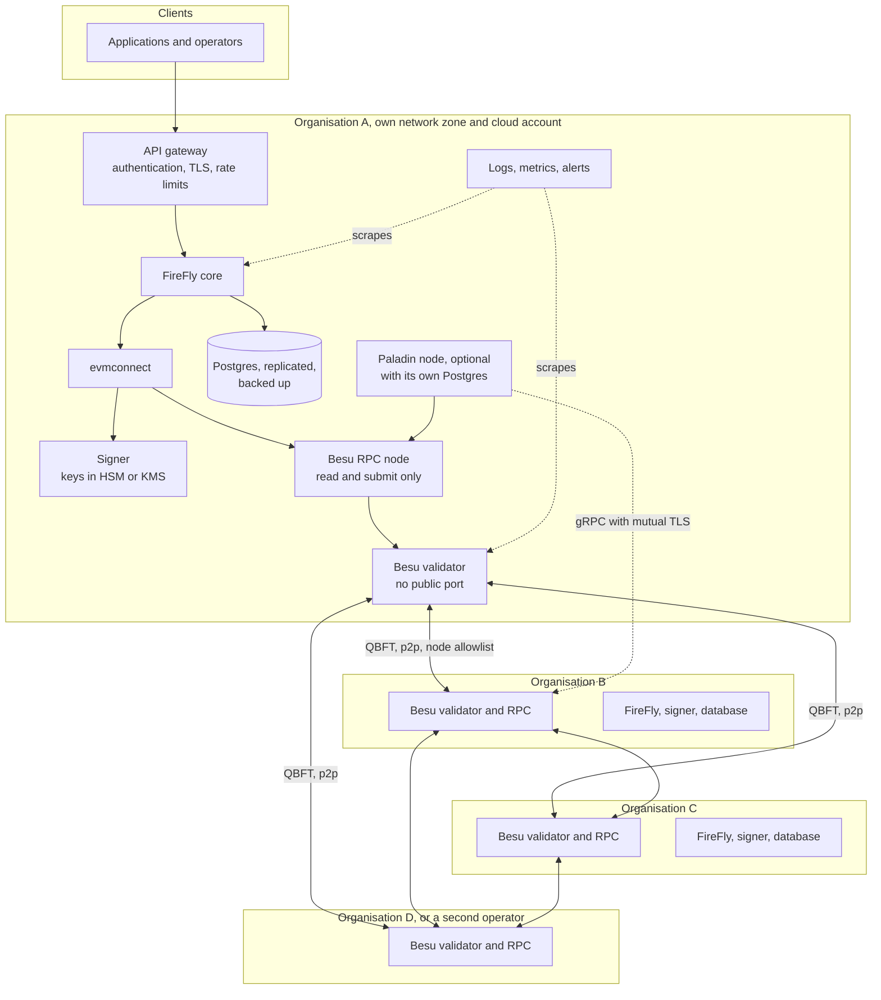
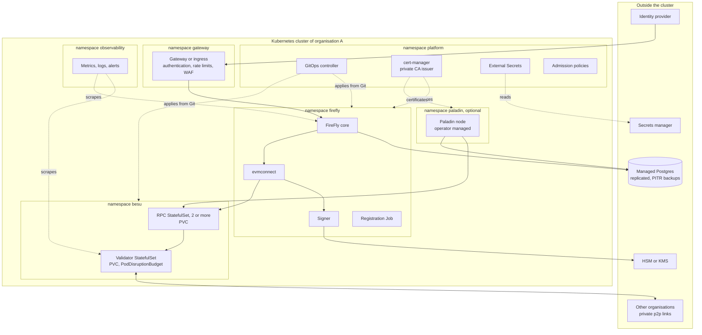
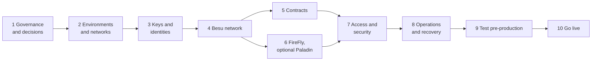
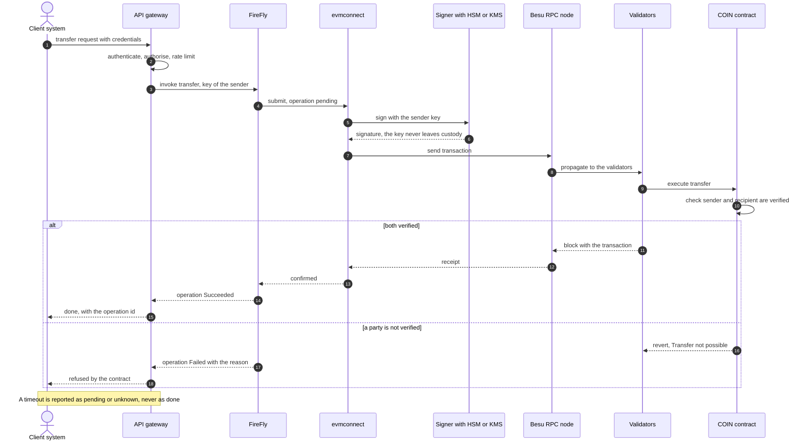

# Taking this stack to production: a discussion document

> **Status:** discussion draft, 2026-10-04. Nothing here has been built or run in a production environment.
> **How to read it:** what this repository does today is stated as fact and points to where it is recorded. Everything about production is a **proposal** to argue with. Where a statement depends on a product's current capabilities that were not checked for this document, it is marked **(verify)**.

The repository is a local demo: one host, one validator, demo keys, no authentication. This document asks what it would take to run the same pieces (Besu, FireFly, the ERC-3643 `COIN` token and, optionally, Paladin Noto) for real, in what order, and which decisions have to be made first.

---

## 1. What the demo does that production cannot

Each row is a deliberate shortcut in this repository and what it would have to become.

| Demo choice (where it is recorded) | Why it is fine for the demo | What production needs |
|---|---|---|
| **One validator, one RPC node**, on one Docker host (plan D-01, D-17) | Four validators on one laptop made QBFT stall when one stopped; one is a valid QBFT network | At least four validators run by separate operators on separate hosts, and spare capacity so that maintenance never leaves exactly the quorum (section 4, step 4) |
| **Demo keys, committed** (plan D-10): validator, wallets, signer keystores, Paladin mnemonics | A fresh clone needs no setup | No key ever in git. Keys generated where they will live, in an HSM or KMS, with a custody and rotation policy (step 3) |
| **No authentication anywhere**; every port bound to localhost (architecture, security section) | One user on one machine | Authenticated and authorised APIs, mutual TLS between components, network segmentation (step 7) |
| **Zero gas price** (`--min-gas-price=0`) | No funding of accounts | A deliberate gas and access policy for the network (step 4) |
| **One FireFly, one Postgres, no replication** | Simple | Highly available database, backups that are restored in rehearsal, a recovery objective (step 8) |
| **FireFly gateway mode, one signer with a file keystore** | Simplest signing path | A key custody model chosen for the real signing keys (step 3) |
| **Self-signed TLS for Paladin**, certificates committed | Nodes can talk to each other | A real certificate authority and rotation (step 6) |
| **A `deployer` container with the Docker socket mounted** deploys everything when you run `docker compose up` | One command, and a job that can restart the Paladin nodes | A deploy that runs from a pipeline with approval gates and a controlled identity, never a container with control of the host's Docker (steps 5 and 6) |
| **Admin wallet is token agent, registry owner and claim issuer** | One identity does everything | Separate roles, multi-signature or a governed process for each (step 5) |
| **Phase 0 to 5 were measured on a laptop**; FireFly layer took about 8 TPS before failing (docs/perf-results.md) | Shows the method | Capacity measured on the real topology, with real signing and a real database (step 9) |
| **Contracts deployed by a Python script from pinned npm artifacts**, not audited by this project | Official T-REX 4.1.6 and OnchainID 2.1.0 | An audit or a documented reliance on the vendor's, a controlled deployment pipeline, a decision on upgradeability (step 5) |

---

## 2. Decisions to make before building anything

These change the architecture, so they come first. Each has a default I would propose.

| # | Decision | Why it matters | Proposed default |
|---|---|---|---|
| 1 | **Who are the participants?** One organisation running everything, or several organisations, each running its own nodes | Decides whether this is a private network (one operator) or a consortium (shared governance), and who holds which keys | Consortium of at least three organisations, because that is where Besu with QBFT earns its place |
| 2 | **Regulatory scope of the token** (securities rules, KYC provider, jurisdictions, data residency, retention) | Drives the claim issuer, what may be stored on chain, and where Postgres lives | Nothing personal on chain; only claim hashes and signatures. Get compliance sign-off before step 5 |
| 3 | **Is Paladin needed?** A private token (Noto) beside the public-to-participants `COIN` | It doubles the number of components and keys to run | Leave Paladin out of the first release; add it when a private-transfer use case is confirmed |
| 4 | **How do users and systems reach the network?** Which client talks to FireFly, from where | Decides gateway, authentication and rate limiting | An API gateway in front of each organisation's FireFly; no direct exposure of FireFly or Besu RPC |
| 5 | **Hosting model**: Kubernetes, VMs, or a managed blockchain service | Decides tooling for steps 2 and 8 | Kubernetes per organisation, infrastructure as code; keep the two clouds or sites independent |
| 6 | **Availability and recovery targets** (uptime, recovery time, acceptable data loss) | Decides validator count, database topology and the cost | Write them down first; everything in step 8 follows from them |
| 7 | **Key custody** (who can sign what, and how a key is replaced) | The hardest thing to change later | HSM or cloud KMS for every long-lived key; signing roles separated (step 3) |
| 8 | **Gas policy**: free gas with permissioned access, or priced gas | Affects spam resistance and operations | Permissioned network, zero or fixed gas price, with account and node allowlists (step 4) |

---

## 3. Target shape

One organisation's slice is drawn in full; the others repeat it. Solid arrows are traffic, the dashed ones are administration and monitoring.



Notes on the picture:
- **Validators are not reachable from outside the consortium.** Clients only reach an organisation's gateway; only RPC nodes talk to FireFly and Paladin.
- **Four validators is the minimum for tolerating one fault** (QBFT needs more than two thirds). With exactly four, taking one down for maintenance leaves exactly the quorum, and in this project's own experience that made block production slow and erratic (plan D-17). Plan for five or more, or for upgrades that go one validator at a time with the others healthy.
- **Each organisation runs its own FireFly, signer and database** so that no organisation's keys or data sit with another. FireFly's own multiparty features are not used here; this is gateway mode, as in the demo.

---

### Kubernetes assumptions used for the deliverables below

- **One cluster per organisation and per environment** (development, pre-production, production). Organisations never share a cluster, so no organisation's keys or data sit on another's nodes.
- **Everything is declared in Git** (Helm charts or Kustomize overlays, plus infrastructure as code for the cloud resources) and applied by a GitOps controller. Nobody applies manifests by hand in production.
- **Stateful pieces** (chain data, Postgres) live on encrypted persistent volumes with snapshots. Postgres and the HSM or KMS may be managed cloud services outside the cluster; the diagram shows them outside on purpose.
- **Chart and operator choices are open.** Whether to use community Helm charts for Besu and FireFly, or write your own, is a decision for step 2 **(verify what is maintained for the pinned versions)**. Paladin ships a Kubernetes operator and custom resources, which is why the vendored artifacts in `contracts/paladin/` include `SmartContractDeployment` resources **(verify the operator's current maturity)**.

One organisation's cluster:



## 4. Step by step

The order matters: each step assumes the earlier ones are finished and signed off. Rough effort is given for planning only; it depends heavily on the answers in section 2. Each step lists its actions, its deliverables on Kubernetes (with sample names) and its exit conditions, which are checks a person can run, not opinions.



### Sample names used below

Every name is **illustrative**, to make the deliverables concrete; change them to your conventions. Organisations are `orga`, `orgb`, `orgc`, `orgd`; environments are `dev`, `preprod`, `prod`.

```text
consortium-platform/                 one Git repository per organisation (or a shared one for the consortium; decide in step 1)
  docs/decisions/                    ADR-001-participants.md, ADR-002-key-custody.md, ...
  docs/governance/                   charter.md, ownership-matrix.md, slo.md, threat-model.md
  runbooks/                          validator-down.md, chain-stalled.md, key-compromise.md, ...
  infra/
    modules/                         cluster/, network/, kms/, postgres/, dns/
    envs/{dev,preprod,prod}/orga/    main.tf, variables.tf (one directory per organisation and environment)
  platform/                          cert-manager/, external-secrets/, argocd/, policies/, observability/
  charts/                            besu/, firefly/, paladin/, contract-deploy/
  deploy/{dev,preprod,prod}/orga/    argocd-apps.yaml, besu-values.yaml, firefly-values.yaml
  contracts/                         artifacts.lock (checksums), roles.md, deploy-job/
  tests/                             functional/, load/, chaos/, results/
```

Kubernetes objects: namespaces `platform`, `gateway`, `besu`, `firefly`, `paladin`, `observability`; workloads `besu-validator` and `besu-rpc` (StatefulSets), `firefly-core`, `firefly-evmconnect` and `firefly-signer` (Deployments); ConfigMaps `besu-genesis`, `besu-bootnodes`, `besu-permissions`; `ClusterIssuer` `consortium-ca`; `StorageClass` `chain-ssd-encrypted`; `VolumeSnapshotClass` `chain-snapshots`.

### Step 1. Governance and decisions (weeks)

1. Answer section 2 and write the answers down as decisions with owners.
2. Agree who may join or leave the validator set, who may change the contracts, who may pause the token, and how disputes are settled. A consortium without this fails on the first disagreement.
3. Get compliance and legal sign-off on what is on chain, who the claim issuer is, and the data residency of Postgres and logs.
4. Write the availability and recovery targets (decision 6).

**Deliverables on Kubernetes**

- **Decision log**: `docs/decisions/ADR-001-participants.md` to `ADR-008-gas-policy.md`, one per decision in section 2, each with owner, date and the alternatives rejected.
- **Governance charter**: `docs/governance/charter.md` (who may change validators, contracts, the issuer and the token's pause switch, and how disputes are settled), signed by every organisation.
- **Ownership matrix**: `docs/governance/ownership-matrix.md` (which organisation owns which cluster, cloud account, key and runbook).
- **Targets**: `docs/governance/slo.md` (uptime, recovery time, acceptable data loss), the document later steps are tested against.
- **Kubernetes topology decision**: `ADR-009-kubernetes-topology.md` (clusters `orga-dev`, `orga-preprod`, `orga-prod`, regions, namespace and access model).
- **Naming and tagging conventions**: `docs/governance/naming.md` (the names in this section are a draft of it).

**Exit conditions** (all must hold before the next step starts)

- [ ] Every decision in section 2 has a signed ADR with an owner (8 of 8).
- [ ] The governance charter is signed by all participating organisations.
- [ ] The availability and recovery targets exist as numbers, not adjectives.
- [ ] Compliance and legal have signed off in writing on what is on chain and on data residency.
- [ ] Nothing in step 2 has been provisioned yet except a sandbox for evaluation.

### Step 2. Environments and networks (weeks)

1. Create separate environments: development, a pre-production that mirrors production, and production. The pre-production must have the same topology and the same key custody, only with test keys.
2. Define the infrastructure as code, and the network zones: validators in a closed zone, RPC and FireFly in an application zone, the gateway in front.
3. Set up DNS, and a private certificate authority for the mutual TLS between components (also used by Paladin in step 6).
4. Set up the container registry, the build and deployment pipeline, and image pinning by digest as this repository already does for FireFly. Keep software bills of materials for the images you ship.
5. Set up central logging and metrics before the first node starts, not after.

**Deliverables on Kubernetes**

- **Infrastructure as code**: modules `infra/modules/cluster`, `network`, `kms`, `postgres`, `dns`, and one environment directory per organisation (`infra/envs/prod/orga/`), each with a reviewed plan before apply.
- **Three clusters per organisation**: `orga-dev`, `orga-preprod`, `orga-prod`, with `orga-preprod` identical in shape to `orga-prod`.
- **Node pools**: `pool-system`, `pool-chain` (validators and any self-run database, the storage-heavy workloads, with encrypted disks) and `pool-apps`.
- **Namespaces** with quotas, limit ranges and a default-deny `NetworkPolicy` named `default-deny`: `platform`, `gateway`, `besu`, `firefly`, `paladin` (if used), `observability`.
- **RBAC**: `Role` and `RoleBinding` objects per namespace (`besu-operator`, `firefly-operator`, `auditor-readonly`) and the break-glass procedure `runbooks/break-glass-access.md`.
- **Storage**: `StorageClass` `chain-ssd-encrypted` and `VolumeSnapshotClass` `chain-snapshots`.
- **Certificates**: cert-manager in `platform`, and `ClusterIssuer` `consortium-ca` backed by the private CA, with the CA procedure in `runbooks/private-ca.md`.
- **Gateway**: a gateway or ingress controller in `gateway` with a web application firewall policy, DNS records such as `api.orga.example.net`, and public certificates.
- **GitOps**: the repository layout above, a controller in `platform/argocd/`, and one `Application` per component and environment (for example `orga-prod-besu`), with branch protection and mandatory review.
- **CI pipeline**: `.github/workflows/build.yaml` (or the equivalent) that builds, tests, scans, writes a software bill of materials, signs images and pushes them by digest to `registry.example.net/consortium/`.
- **Admission policies**: `platform/policies/` (for example `require-signed-images`, `restricted-pod-security`, `no-privileged`) **(verify the engine chosen)**.
- **Observability**: `platform/observability/` (metrics, logs, alert routing) installed before any chain node.
- **Secrets plumbing**: External Secrets operator and a `ClusterSecretStore` named `consortium-secrets` pointing at the secrets manager.

**Exit conditions** (all must hold before the next step starts)

- [ ] A pipeline run deploys an empty `orga-preprod` from Git with no manual command, twice, and destroys and recreates it once.
- [ ] From outside the clusters, the only reachable endpoint is the gateway (a port scan shows nothing else).
- [ ] A test pod in each namespace cannot reach a namespace it should not (default-deny verified).
- [ ] An unsigned image and a privileged pod are both rejected by admission.
- [ ] The metrics and log stack is receiving data from the clusters themselves.
- [ ] `orga-preprod` and `orga-prod` differ only in size, names and keys (diff of the rendered configuration).

### Step 3. Keys and identities (weeks)

This is the step most likely to be done too late. The demo's keys (validators, wallets, signers, Paladin mnemonics) must not exist in production.

1. List every key and its role: validator keys, node keys, FireFly signing keys per role (the token agent, registry owner, claim issuer, each business user), Paladin keys, TLS keys, database credentials.
2. Choose a custody model per key class: HSM or cloud KMS for long-lived and high-value keys, with a documented ceremony for generating them and for backing up or splitting them. **(verify)** which of these FireFly's signer and evmconnect, Besu, and Paladin support today; the demo signer is file-based, so a different signing path may be needed, such as an external signer or custody service.
3. Separate roles so that no single key can do everything the demo's Admin does today (section 1, last rows).
4. Define rotation and revocation, and rehearse replacing a validator key and a signing key in pre-production.
5. Use a secrets manager for credentials. Add secret scanning to the pipeline so a key cannot be committed again.

**Deliverables on Kubernetes**

- **Key inventory**: `docs/governance/key-register.md` (key, role, owner, custody system, rotation period, recovery path; public addresses only).
- **HSM or KMS as code**: `infra/modules/kms` with keys such as `orga-prod-validator`, `orga-prod-signer-agent`, `orga-prod-issuer`, access policies per role, and audit trails on.
- **Workload identity**: `ServiceAccount` `firefly-signer` in `firefly` mapped to a cloud IAM role, so no long-lived cloud credential sits in a Secret.
- **Key ceremony**: `runbooks/key-ceremony.md` and the signed record `docs/governance/ceremonies/2026-xx-validator-keys.md` (who attended, what was generated, how backups were split).
- **Secrets as ExternalSecrets**: `ExternalSecret/firefly-db`, `ExternalSecret/firefly-api-clients`, `ExternalSecret/besu-node-keys`; no secret in a manifest, a chart value or a ConfigMap.
- **Secret-scanning**: a pipeline step and a pre-commit hook, plus `docs/governance/history-scan-2026-xx.md` (nothing sensitive in the repository history).
- **Rotation and revocation**: `runbooks/rotate-validator-key.md`, `rotate-signing-key.md`, `rotate-certificate.md`, and the rehearsal report in `tests/results/key-rotation-preprod.md`.

**Exit conditions** (all must hold before the next step starts)

- [ ] Every key in the register exists in its custody system, and a search of the clusters, Git and the registry finds no key material.
- [ ] The signer authenticates to the HSM or KMS through workload identity only.
- [ ] A validator key, a signing key and a certificate have each been replaced in pre-production following the runbook, by someone other than its author.
- [ ] The pipeline fails on a deliberately committed test secret.
- [ ] The ceremony record is signed by the attendees.

### Step 4. The Besu network (weeks)

1. **Genesis.** QBFT with the real chain id, block period (this demo uses 2 s; choose from latency and load needs, not by default), gas limit and fork schedule. Generate it with Besu's own tooling from the real validator keys, as this repository does (plan D-03), never by hand.
2. **Validators.** At least four, run by independent operators on independent infrastructure, with spare capacity so that upgrades are one at a time (section 3).
3. **Validator management.** Decide how validators are added and removed: by validator votes or by a validator contract **(verify the current options for the pinned Besu version)**, and tie it to the governance in step 1.
4. **Permissioning.** Allowlist nodes so only members connect; consider account permissioning so only known senders can submit. This is also the answer to decision 8 if gas stays free.
5. **RPC nodes.** At least two per organisation behind the gateway, not exposed directly. Validators open no RPC at all, as in the demo.
6. **Bootstrapping.** Peer discovery through documented static nodes or bootnodes, not the demo's `static-nodes.json` committed file.
7. **Persistence and backups.** Data on durable volumes (the demo wipes it on `reset`); regular snapshots; a tested restore.
8. **Upgrade procedure.** A written rolling-upgrade runbook, tried in pre-production, including a hard-fork schedule.

**Deliverables on Kubernetes**

- **Reviewed genesis**: `deploy/prod/orga/besu-genesis.json` as `ConfigMap/besu-genesis` (public data), generated by Besu's own tooling from the real validator addresses.
- **Validators**: `StatefulSet/besu-validator` per organisation, one persistent volume per pod, `PodDisruptionBudget/besu-validator`, anti-affinity so validators of one organisation never share a node, resource requests and limits, probes, image by digest.
- **RPC nodes**: `StatefulSet/besu-rpc` (two or more) behind `Service/besu-rpc` (`ClusterIP`); validators have no RPC Service.
- **Peering**: `Service/besu-validator-p2p` reachable only over the private links between organisations, with `NetworkPolicy/allow-p2p-from-members` and matching firewall rules.
- **Bootstrap and permissions**: `ConfigMap/besu-bootnodes` and `ConfigMap/besu-permissions` (node allowlist, and account allowlist if chosen) **(verify the options for the pinned Besu)**.
- **Validator management**: `docs/governance/validator-management.md` and the contract or voting configuration behind it.
- **Backups**: `VolumeSnapshot` schedule for the chain data and `runbooks/restore-chain-from-snapshot.md`, tested.
- **Metrics**: `ServiceMonitor/besu` and `PrometheusRule/besu-alerts` (block height, block time, peers, validator participation).
- **Upgrades**: `runbooks/upgrade-besu-rolling.md` and `tests/results/besu-upgrade-preprod.md`.
- **Network test report**: `tests/results/network-preprod.md`.

**Exit conditions** (all must hold before the next step starts)

- [ ] All validators of all organisations are Ready and take part in block production.
- [ ] Blocks follow the configured block period with no gap longer than three periods (a proposed threshold) over 24 hours.
- [ ] With one validator stopped, blocks keep being produced and, after it restarts, it catches up without intervention; this is the test the demo dropped in D-17.
- [ ] A node outside the allowlist cannot join, and an account outside the allowlist (if used) cannot submit.
- [ ] A snapshot of the chain data has been restored into a clean namespace and the node synced.
- [ ] A rolling upgrade of one validator at a time has been done in pre-production with no stall.

### Step 5. Contracts (weeks)

1. Decide whether to rely on the vendor's audit of T-REX and OnchainID or commission your own, and review the exact versions pinned. Fix the compiler and EVM settings against the chain's fork level (the spike recorded this in `docs/spike-results.md`).
2. Decide on upgradeability and who controls it. T-REX uses proxy and implementation contracts, so the control of upgrades is itself a governance asset.
3. Replace the demo's single Admin: separate the token agent, the identity registry agent, the trusted issuers registry owner and the compliance owner, and put the high-impact ones behind a multi-signature wallet or a governed process.
4. **Claim issuer.** The demo's issuer is the Admin key signing a placeholder claim ("KYC verified"). Production needs a real issuer with a real verification process, claim topics that match the regulatory scope, expiry and revocation of claims, and a policy for what a failed verification does to a holder.
5. Deploy through the pipeline with reviewed artifacts, record every address in a controlled, signed record (the demo writes a local `deployed-addresses.json`), and keep the deployment transactions as evidence.
6. Define emergency actions (pause, forced transfer, freeze) and who may trigger them, and test them in pre-production.

**Deliverables on Kubernetes**

- **Audit evidence**: `contracts/audit/` (the report, or the signed decision to rely on the vendor's), naming the versions of T-REX and OnchainID and the compiler and EVM settings.
- **Pinned artifacts**: `contracts/artifacts.lock` (name, version, SHA-256) with the artifacts in an artifact repository (the demo reads them from npm at deploy time).
- **Role design**: `contracts/roles.md` (token agent, registry agent, trusted issuers owner, compliance owner, proxy admin, and the multi-signature or governed process for each high-impact one).
- **Deployment job**: `charts/contract-deploy` run as `Job/contract-deploy-trex` from the pipeline, under the signer's workload identity, with manual approval gates for production.
- **Address record**: `releases/prod/addresses.signed.json`, a signed release artifact (not a local file as in the demo).
- **Verification report**: `tests/results/bytecode-match-prod.md` (the code on chain matches the audited artifacts).
- **Claim issuer**: `docs/governance/claim-issuer.md` (process, topics, expiry, revocation) and, if it is a service, `Deployment/claim-issuer` in `firefly` with its key in the HSM or KMS.
- **Emergency actions**: `runbooks/pause-token.md`, `freeze-account.md`, `forced-transfer.md`, with `tests/results/emergency-actions-preprod.md` as evidence of a rehearsal.

**Exit conditions** (all must hold before the next step starts)

- [ ] The contracts are deployed in pre-production by the pipeline, with no human running a deploy command.
- [ ] The deployed bytecode matches the pinned artifacts, and every role is held by the intended account, checked by reading the chain.
- [ ] No single key can pause, upgrade and issue claims.
- [ ] Each emergency action has been carried out in pre-production by the named owner.
- [ ] The audit findings are closed, or each open one has an accepted-risk record signed by the owner.

### Step 6. FireFly, and optionally Paladin (weeks)

1. **FireFly per organisation**, gateway mode as in the demo, with its signer and evmconnect configured for the custody model of step 3, and a replicated Postgres behind it.
2. **Namespaces and registrations.** Register the contract interface and API from the deployed addresses through the pipeline (what `deploy` does for the demo), not by hand.
3. **One key, one writer.** Observed in this project: FireFly's evmconnect works out a key's next nonce from its own records, so a key that is also used to send transactions some other way falls behind with `Nonce too low`, and a restart does not fix it (`docs/spike-results.md`, Phase 5 findings). In production every signing key must be written to through exactly one path.
4. **Capacity.** The demo's FireFly layer took about 8 TPS before submissions timed out (`docs/perf-results.md`); real signing, a real database and real network latency change that, up or down. Measure it in step 9 and size evmconnect and the database from the result, not from this number.
5. **Paladin, if in scope.** One node per organisation, each with its own Postgres, certificates from the private authority of step 2 (the demo's self-signed ones are not acceptable), the registry and Noto contracts deployed and governed like those in step 5, and a decision on who the notary is, because the notary sees every transaction of a token.

**Deliverables on Kubernetes**

- **FireFly workloads** per organisation from `charts/firefly` and `deploy/prod/orga/firefly-values.yaml`: `Deployment/firefly-core`, `firefly-evmconnect`, `firefly-signer`, configuration in `ConfigMap/firefly-core-config` and `firefly-evmconnect-config`, credentials from ExternalSecrets, `ClusterIP` Services, and `NetworkPolicy/allow-firefly-to-rpc` and `allow-firefly-to-db`.
- **Postgres for FireFly**: a managed instance or an operator-run cluster (`Cluster/firefly-pg`) with replicas, point-in-time recovery and `runbooks/restore-firefly-db.md`, tested **(verify the operator chosen)**.
- **Registration**: `Job/firefly-register-coin`, an idempotent Job that registers the contract interface and API from the address record of step 5 (what the demo's `deploy` does locally).
- **One-writer rule**: `docs/governance/one-writer-rule.md` and an alert `PrometheusRule/firefly-nonce-errors` on `Nonce too low`.
- **Capacity plan**: `docs/governance/capacity.md`, filled in from the load test of step 9.
- **If Paladin is in scope**: the operator and its custom resources from `charts/paladin` (one node per organisation, named for example `paladin-orga`), `Cluster/paladin-pg`, `Certificate/paladin-orga-tls` issued by `consortium-ca`, Jobs for the registry and Noto contracts, the notary decision `ADR-010-paladin-notary.md`, and the privacy checks of the demo's tests run against pre-production **(verify the operator's resource names)**.

**Exit conditions** (all must hold before the next step starts)

- [ ] Each organisation's FireFly reads and writes through the `coin` contract API using its own signer, with the key in the HSM or KMS.
- [ ] The registration Job is idempotent: running it twice changes nothing the second time.
- [ ] FireFly survives a restart of its database primary and of evmconnect with no lost or stuck operation.
- [ ] No `Nonce too low` event is recorded over a 24-hour soak in pre-production.
- [ ] If Paladin is included: a Noto transfer between two organisations succeeds, a third organisation's node sees none of it, and the public chain shows no amounts.

### Step 7. Access and security (weeks)

1. **Authentication and authorisation.** Put an API gateway in front of FireFly with strong authentication and per-client authorisation; FireFly itself offers limited options **(verify)**, so the gateway is where users and systems are identified. The demo has none.
2. **Mutual TLS** between components, from the private authority.
3. **Network policy.** Validators accept only validator and RPC traffic; FireFly reaches only its own database, signer and RPC node; databases accept only their own service.
4. **Least privilege** for every service account and operator, with audited, time-limited administrative access.
5. **Audit logging** of every administrative and signing action to a store the operators cannot alter.
6. **Threat model.** Write one: a compromised signer, a malicious validator, a stolen API credential, a poisoned image, a misbehaving claim issuer. Review the findings with every organisation.
7. **Penetration test** against pre-production.

**Deliverables on Kubernetes**

- **Gateway policy**: `deploy/prod/orga/gateway-policy.yaml` (authentication, per-client authorisation, rate limits, web application firewall rules); FireFly and Besu are reachable only through it.
- **Mutual TLS**: `Certificate/firefly-core-tls`, `besu-rpc-tls` and so on from `consortium-ca`, or a service mesh policy (the choice recorded as `ADR-011-mtls.md`).
- **NetworkPolicy set**: `platform/policies/network/` with a test suite `tests/functional/network-policy.yaml` that proves what is blocked (for example a pod in `gateway` cannot reach `besu-validator`).
- **Pod security**: namespace labels enforcing the `restricted` profile and an exceptions register `docs/governance/policy-exceptions.md`.
- **Access**: `docs/governance/access-review.md` (quarterly RBAC review) and the audited, time-limited administrative access procedure.
- **Audit logging**: Kubernetes audit, gateway, signer and administrative logs shipped to write-once storage, configured in `platform/observability/audit/`.
- **Threat model**: `docs/governance/threat-model.md` and its review minutes with every organisation.
- **Penetration test**: `tests/results/pentest-preprod.pdf` and the tracked remediation `tests/results/pentest-remediation.md`.
- **Supply chain**: signed images, software bills of materials and the latest scan results for every image under `tests/results/supply-chain/`.

**Exit conditions** (all must hold before the next step starts)

- [ ] A request without valid credentials is rejected at the gateway; a valid client gets only what its role allows.
- [ ] Every component-to-component call is mutually authenticated (verified by a plaintext attempt that fails).
- [ ] The network-policy test suite passes in every namespace.
- [ ] The penetration test has no open high or critical finding.
- [ ] An administrative action by an operator appears in the audit log within the agreed delay, and the operator cannot delete it.

### Step 8. Operations and recovery (weeks, then continuous)

1. **Monitoring and alerting.** Block height and block time, validator participation, peer count, RPC latency, FireFly queue depth and pending operations, database health, signer errors, certificate expiry.
2. **Runbooks.** Validator down, chain stalled, database lost, key compromised, contract paused, failed upgrade. Each with an owner and a rehearsed procedure.
3. **Backups and restore.** Back up each Postgres and the chain data; restore into a clean environment on a schedule and measure the time against the target of step 1. FireFly's database holds the transaction and operation tracking, and losing it mid-flight loses that state (the PRD accepts this for the demo; production should not).
4. **Disaster recovery.** At least one validator and one RPC node per organisation outside the primary site.
5. **Change management.** All changes through the pipeline, with review, and a way to roll back.
6. **Cost and capacity review** on a schedule.

**Deliverables on Kubernetes**

- **Dashboards and alerts**: `platform/observability/dashboards/besu.json`, `firefly.json`, `signer.json`, `postgres.json`, and rules `PrometheusRule/besu-alerts`, `firefly-alerts`, `cert-expiry` routed to the on-call rota.
- **Runbooks** in `runbooks/`: `validator-down.md`, `chain-stalled.md`, `database-lost.md`, `key-compromise.md`, `token-paused.md`, `failed-upgrade.md`, `certificate-expired.md`, each with an owner.
- **Backup automation**: `VolumeSnapshot` schedules, database point-in-time recovery settings, and cluster resource backup with `Schedule/daily-cluster-backup` **(verify the tool chosen)**.
- **Disaster recovery site**: `deploy/prod/orga-dr/` (a standby validator, RPC nodes and the FireFly stack in a second region), as manifests in Git.
- **Restore drill report**: `tests/results/restore-drill-2026-xx.md` with the measured recovery time and data loss.
- **Change management**: `docs/governance/change-process.md` (reviews, approvals, rollback) and an upgrade calendar `docs/governance/upgrade-calendar.md`.
- **On-call**: `docs/governance/oncall.md` (rota and escalation across organisations).
- **Cost and capacity**: a cost dashboard and a quarterly review date in `docs/governance/slo.md`.

**Exit conditions** (all must hold before the next step starts)

- [ ] Every runbook has been executed at least once in pre-production by someone other than its author.
- [ ] The measured recovery time and data loss are within the targets of step 1, shown in the drill report.
- [ ] Every alert has fired in a test and reached the on-call person.
- [ ] A full restore of the chain data and of each database from backup into a clean environment has succeeded.
- [ ] The DR site can take over, tested once end to end.

### Step 9. Test in pre-production (weeks)

1. **Functional.** The existing integration tests, adapted to run against pre-production, plus tests for the real roles and permissions.
2. **Load.** The Caliper project in `perf/` is a starting point: the same transfer through the chain layer and the FireFly layer, with a real signing path and many more keys. Report numbers with their configuration, as this repository does, and never as limits.
3. **Failure.** Stop a validator, stop an RPC node, stop FireFly and its database, lose a zone, expire a certificate, replace a key. Production must keep the fault-tolerance test that this demo gave up.
4. **Recovery drill.** Restore from backup into a clean environment, with a person who did not write the runbook.
5. **Security.** The penetration test of step 7 and a review of the audit log.

**Deliverables on Kubernetes**

- **Pre-production parity**: `deploy/preprod/orga/` rendered from the same charts as `deploy/prod/orga/`; the diff is documented in `tests/results/preprod-parity.md`.
- **Functional tests**: `tests/functional/` (the demo's integration tests adapted to pre-production, plus tests for the real roles and permissions), run as `Job/functional-tests` from the pipeline with archived results.
- **Load tests**: `tests/load/` (the Caliper project of `perf/` as a container image `registry.example.net/consortium/caliper:0.6.0` and `Job/load-test-chain`, `load-test-firefly`), with the real signing path and many more keys; results archived with the configuration beside every number.
- **Failure experiments**: `tests/chaos/` (for example `kill-validator.yaml`, `drain-node.yaml`, `partition-org.yaml`, `expire-cert.yaml`) and `tests/results/chaos-preprod.md` **(verify the chaos tool)**.
- **Recovery drill**: `tests/results/restore-drill-independent.md`, performed by someone who did not write the runbook.
- **Security**: the closed findings of step 7.
- **Sign-off record**: `tests/results/signoff-preprod.md` (every test green twice in a row from a clean pre-production).

**Exit conditions** (all must hold before the next step starts)

- [ ] The functional suite passes twice in a row from a clean pre-production.
- [ ] The load test reaches the target rate of Open Question 9 with no failed transactions, and the capacity plan of step 6 is updated from it.
- [ ] Every failure experiment ends with the system healthy again and no data lost.
- [ ] The independent recovery drill meets the recovery targets.
- [ ] The sign-off record is signed by every organisation.

### Step 10. Go live (days, then continuous)

1. A go-live checklist signed by each organisation: decisions, keys, contracts, security, operations, tests.
2. Start with a small, closed group of real participants and limited value, with the ability to pause the token.
3. Ramp up only after a defined period without incidents.
4. Review after the first month: incidents, capacity, cost, and what the runbooks got wrong.

**Deliverables on Kubernetes**

- **Go-live checklist**: `docs/governance/go-live-checklist.md` signed by each organisation (decisions, keys, contracts, security, operations, tests).
- **Release record**: Git tag `release-1.0.0`, `deploy/prod/orga/` pinned by digest, and `releases/prod/addresses.signed.json` for the contracts production runs.
- **Change window and rollback**: `runbooks/go-live-and-rollback.md`, including how the token is paused.
- **Onboarding plan**: `docs/governance/onboarding-wave-1.md` (the first participants, and the limits on value and volume in the initial period).
- **Hypercare**: `docs/governance/hypercare.md` (named people and hours for the first weeks).
- **Handover**: `docs/governance/handover.md` (architecture, runbooks, contacts, access procedures) to operations.
- **Review**: `docs/governance/post-go-live-review.md` after the first month (incidents, capacity, cost, what the runbooks got wrong).

**Exit conditions** (all must hold before the next step starts)

- [ ] The checklist is signed and the release record matches what is running (checked by digest and by address).
- [ ] The first participants have completed a real transfer end to end, and a deliberately refused one is refused.
- [ ] The pause switch has been shown to work in production, on a test token or in a controlled window.
- [ ] The hypercare period ended with no unresolved severity-one incident.
- [ ] The post go-live review is written and its actions have owners.

---

## 5. What this repository gives you, and what it does not

| Reusable as a starting point | Must be rebuilt or replaced |
|---|---|
| The Python onboarding logic in `src/core/` (identity, registration, claim, mint sequencing, skip-if-already-true) | Anything that holds keys: the committed `network-config/` material, `wallets.json`, signer keystores, Paladin mnemonics |
| The FireFly client and the `besu-ff` CLI as a test and operations client | The Docker Compose topology: one host, one validator, no replication, no auth |
| The error model that never reports success from a pending or unknown write | The single-Admin role model and the placeholder claim issuer |
| The integration test suite as a functional baseline | The deploy path: a local script writing a local addresses file |
| The Caliper project in `perf/` and the way it records the configuration beside every number | Self-signed TLS, demo passwords, the localhost-only port binding as the only protection |
| The findings in `docs/spike-results.md` (nonce handling, FireFly limits, Caliper versions) | The load numbers: they describe a laptop, not production |

---

## 6. Risks specific to this choice of stack

| Risk | Why | Mitigation to discuss |
|---|---|---|
| **Validator set too small** | Four validators leave no spare capacity during maintenance (observed here) | Five or more, one-at-a-time upgrades, tested |
| **One key used through two paths** | evmconnect cannot recover a nonce it did not assign | One writer per key, enforced by design and monitored |
| **FireFly throughput ceiling** | About 8 TPS on the demo before submissions failed | Measure on the real topology, queue and rate limit at the gateway |
| **Key custody not settled early** | Changing it later means re-keying contracts and roles | Decide in step 3, before contracts are deployed |
| **Claim issuer treated as a technical detail** | It is a legal and operational process | Compliance owns it from step 1 |
| **Paladin added too early** | More components and keys, a notary that sees all transactions | Defer until a private-transfer use case is confirmed |
| **Old or unmaintained dependencies** | The benchmark uses Caliper 0.6.0 and `web3@1.3.0` because newer Caliper dropped the Ethereum connector | Keep them out of production; they are test tools |
| **Governance missing** | A consortium without rules fails at the first dispute | Step 1 is not optional |

---

## 7. Questions for the discussion

1. Is this one organisation or a consortium? If one organisation, is QBFT with several validators still worth the cost, compared with a single-operator chain?
2. Which regulation applies to the token, and who is the real claim issuer?
3. Which key custody do you want (HSM, cloud KMS, a custody service), and which of them do FireFly's signer and Besu support today? **(verify)**
4. Do you need Paladin in the first release?
5. Which platform will run it (Kubernetes, VMs, a managed service), and does each organisation bring its own?
6. What are the availability and recovery targets, and what is the budget?
7. Where must data live (Postgres, logs, backups)?
8. Who owns each administrative action: pausing, upgrading, adding a validator, replacing the issuer?
9. What is the first production use case and its expected transaction rate, so the load test of step 9 has a real target?

---

## 8. Appendix: one compliant transfer in production

The path of the demo's `besu-ff invoke transfer`, as it would run with the controls above. Compare with the demo's version in `docs/use-cases.md` (UC-06).


