# Use Cases — besu-with-firefly

> **Owner:** Howin Ho · **Created:** 2026-10-01 · **Status:** Draft
> Companion docs: [prd.md](prd.md) · [architecture.md](architecture.md) · [plan.md](plan.md)

This document is the single reference for end-to-end interaction flows.

Names follow `architecture.md`. Where a FireFly or Paladin behaviour is not yet verified, the use case says so and points at the Phase 0 spike. There is no web frontend, so there are no Playwright specs. Each use case names the `pytest -m integration` test that should cover it.

---

## Actors

| Actor | Role |
|---|---|
| Developer | Runs the stack script (`python scripts/stack.py`), the CLI and Caliper. The only human user |
| Admin | Demo identity. Plays Token Agent and Trusted Issuer (registers, claims, mints) |
| Anson | Demo identity. Holds `COIN` and a Noto balance |
| Beatrice | Demo identity. Receives transfers |
| CLI | Python CLI: CLI adapter, `core`, FireFly adapter (see architecture §2) |
| FireFly | Gateway mode, single node. Deploys contracts, generates the contract API, signs for admin, anson, beatrice |
| Paladin node1 / node2 / node3 | node1 is the notary and registry admin, node2 is Anson, node3 is Beatrice. They host the Noto token and talk over gRPC with mTLS. Peers are found through the on-chain EVM registry |
| Besu network | 4 validators plus `besu-rpc-anson` and `besu-rpc-beatrice` |
| T-REX contracts | On-chain compliance suite, the real authorization boundary |
| Caliper | Benchmark tool in `perf/` |

---

## UC-01: Run the Phase 0 spike

**Goal:** The developer knows whether each risky assumption holds and has a fallback for each one that does not.

**Trigger:** The developer starts Phase 0.

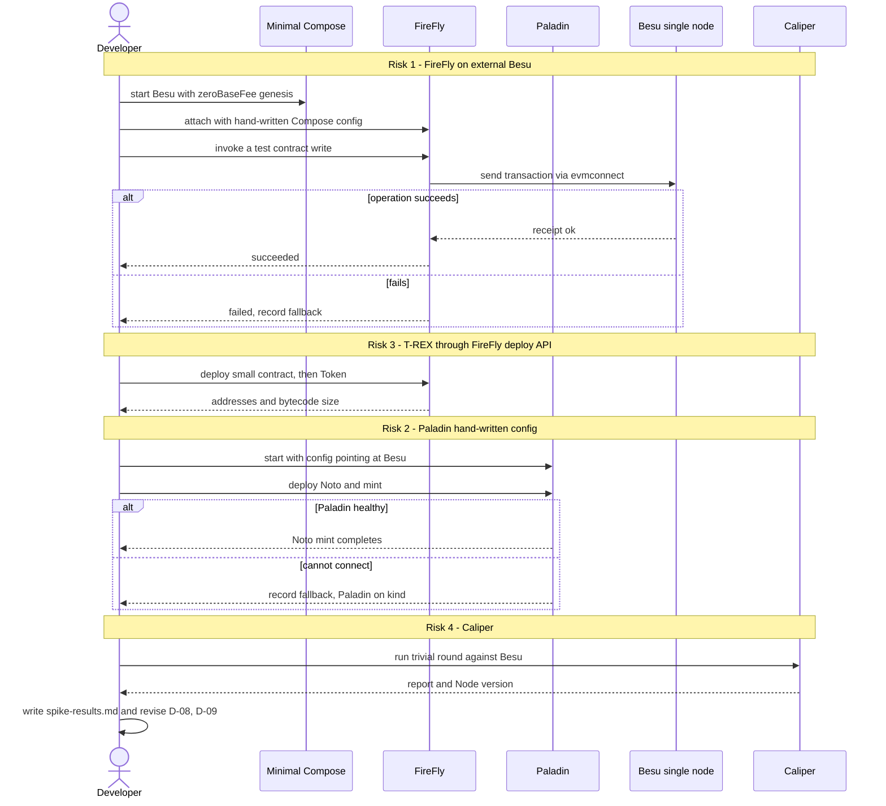

**Notes:**
- Traces to US-001, FR-15, plan.md Phase 0 and D-15.
- Hard gate: no Phase 1 work until each risk has a result and a fallback.
- Also records the EVM version Paladin and FireFly contracts need (D-08).
- Test: none, the output is a document.

---

## UC-02: Generate and start the network

**Goal:** A 4-validator QBFT network with 2 RPC nodes is running and consistent.

**Trigger:** Developer runs `python scripts/stack.py up`.

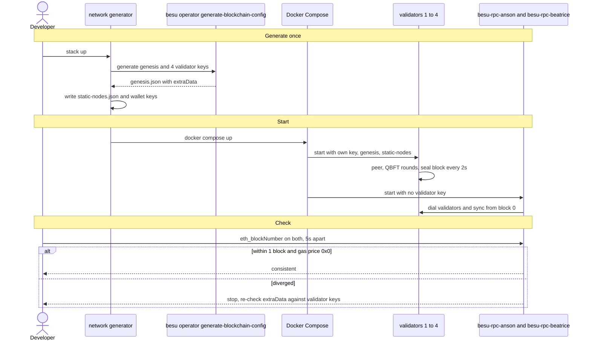

**Notes:**
- Traces to US-002, US-003, FR-1, FR-2. Plan D-01, D-03.
- A node is a validator because of its key, not its container name; the RPC nodes have no validator key.
- Demo keys are committed (D-10).
- Test: `test_network_consistency`.

---

## UC-03: Survive a validator failure

**Goal:** Show that the chain keeps producing blocks with 1 of 4 validators down.

**Trigger:** Developer stops one validator container.

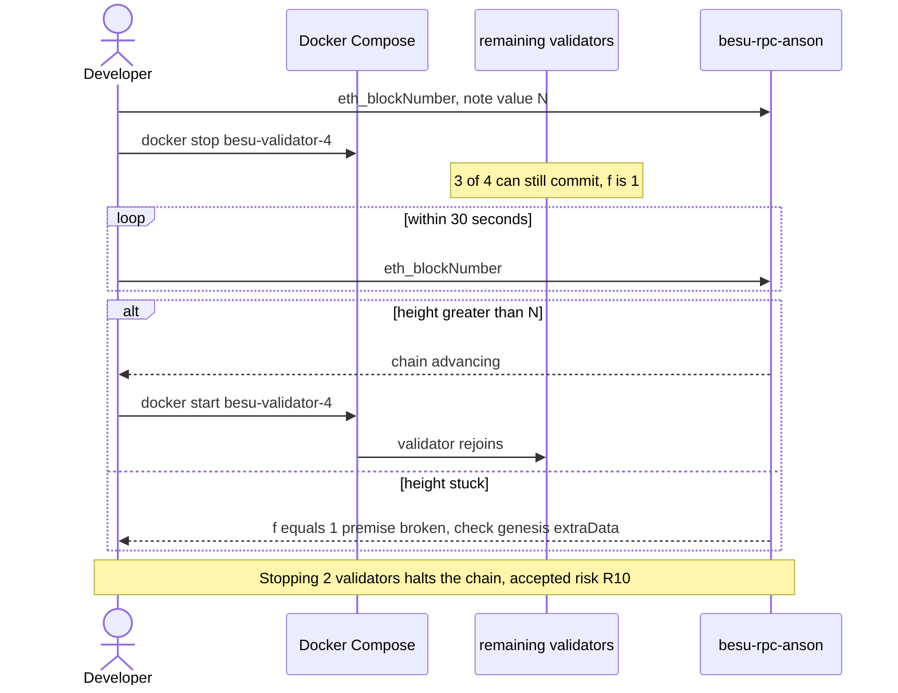

**Notes:**
- Traces to US-002, NFR Availability. Plan Phase 1 anti-gate.
- Test: `test_single_validator_failure`.

---

## UC-04: Deploy the T-REX suite through FireFly

**Goal:** `COIN` and its registries are deployed through FireFly's real deploy process and exposed as a contract API.

**Trigger:** Developer runs `python scripts/stack.py deploy` on a fresh stack.

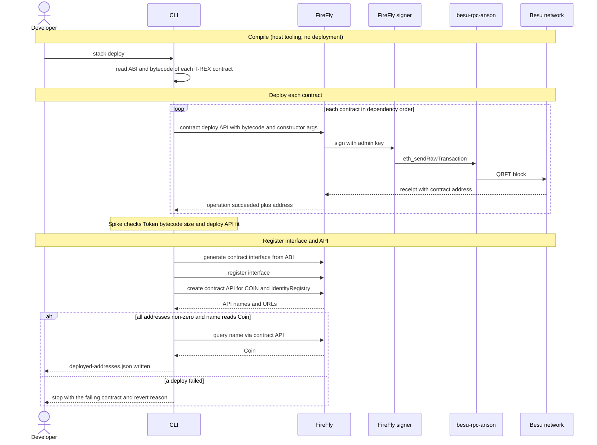

**Notes:**
- Traces to US-005, US-006, FR-4, FR-5. Plan D-04.
- Deploy goes through FireFly, not a direct RPC signer, so FireFly tracks the contracts (architecture §7 B).
- Order matters: registries and implementation authority before Token and ModularCompliance. The exact list comes from the Phase 0 deploy results.
- Contracts are compiled with the EVM target from D-08.
- Test: `test_trex_deployed_through_firefly`.

---

## UC-05: Onboard an identity

**Goal:** An identity is registered, verified and holds `COIN`.

**Trigger:** Developer runs the onboard command for Anson (and later Beatrice).

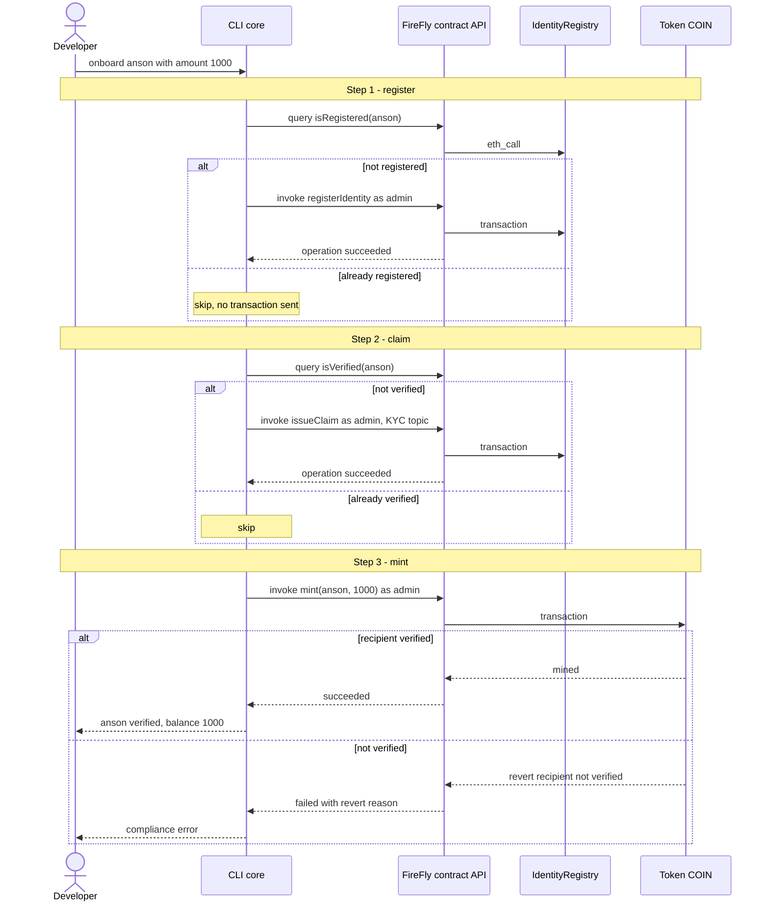

**Notes:**
- Traces to US-007, FR-6. Architecture §8 orchestration sequence.
- Skip-if-already-true avoids paying a block wait for a call that would be a no-op. The contract remains the final backstop.
- Beatrice is onboarded the same way with amount 0 (verified, no mint) so that later transfers to her succeed.
- Test: `test_onboarding_is_idempotent`.

---

## UC-06: Compliant transfer

**Goal:** Anson sends `COIN` to Beatrice and the balances change.

**Trigger:** Developer runs the transfer command acting as Anson.

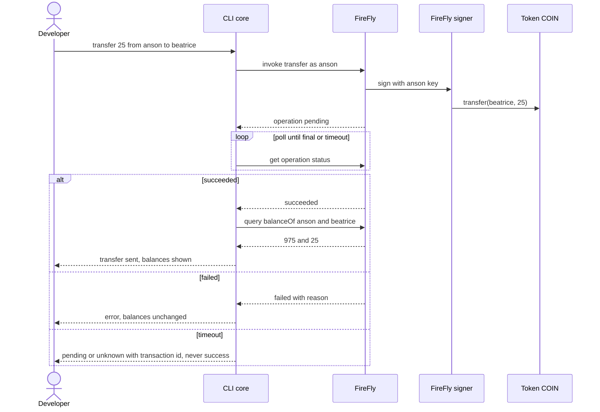

**Notes:**
- Traces to US-008, FR-7, FR-9. Architecture §3 critical path and §5 lifecycle.
- The CLI names the acting identity in its output.
- Test: `test_transfer_between_verified_identities`.

---

## UC-07: Transfer rejected by compliance

**Goal:** A transfer to an unverified recipient fails on-chain and nothing moves.

**Trigger:** Developer sends from Anson to Admin while Admin is not verified.

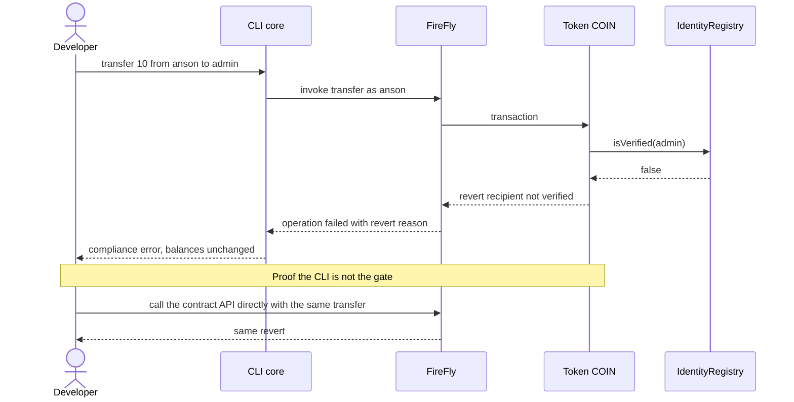

**Notes:**
- Traces to US-008, FR-7. Plan Phase 2 anti-gate.
- The direct call proves the contract, not the CLI, enforces compliance.
- Admin is a real, currently unverified identity in the demo, so this is a genuine rejection, not a fabricated error.
- Test: `test_compliance_rejection`.

---

## UC-08: Private Noto mint and transfer

**Goal:** Node1 (notary) mints a private token to Anson, Anson sends part of it to Beatrice, and Beatrice cannot see Anson's other coins.

**Trigger:** Developer runs the Noto script (Paladin API, not the CLI in v1).

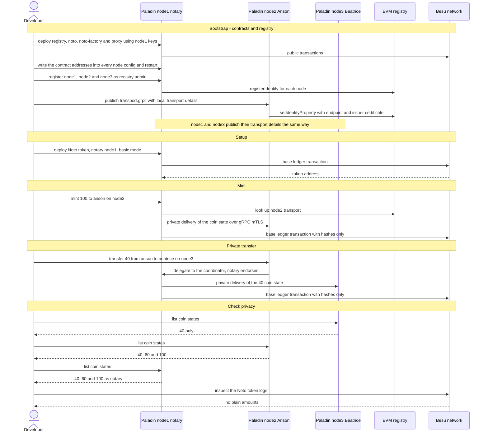

**Notes:**
- Traces to US-009, FR-8. Plan D-05, D-09, Phase 3. Proven in the Phase 0 spike (`docs/spike-results.md`, Risk 2) with exactly these results.
- Paladin needs Postgres. With SQLite the coordinator stalled and the transfer never completed.
- Key addresses are not reproducible from the mnemonic alone, because Paladin stores the path index mapping in its DB. Keep the DB across restarts, and deploy the registry after the DB exists.
- The delegation to the coordinator in the transfer step was seen in the node logs. Which node coordinates is decided by Paladin.
- All Paladin nodes run on one host, so this demonstrates the protocol, not real isolation (risk R11).
- Test: `test_noto_private_transfer`.

---

## UC-09: Reset the stack

**Goal:** Return to a clean state with the chain, FireFly and Paladin consistent.

**Trigger:** Developer runs `python scripts/stack.py reset`.

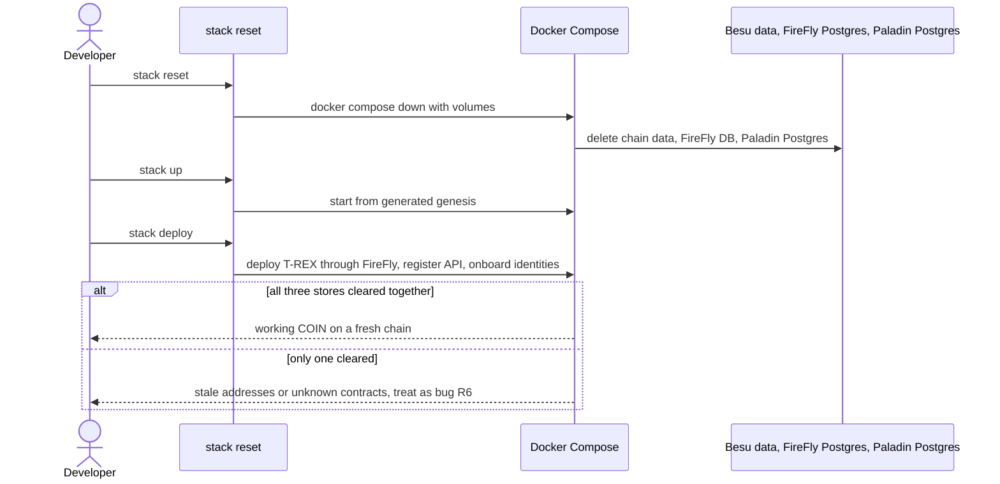

**Notes:**
- Traces to FR-11, plan R6. Plan Phase 2 step 7 and Phase 3 step 5.
- Reset is also the setup for every integration run (US-011).
- Test: `test_reset_repeatability` runs this three times.

---

## UC-10: Benchmark chain layer vs FireFly layer

**Goal:** Produce comparable TPS and latency for direct RPC and for FireFly, and state the difference.

**Trigger:** Developer runs the Caliper rounds in `perf/`.

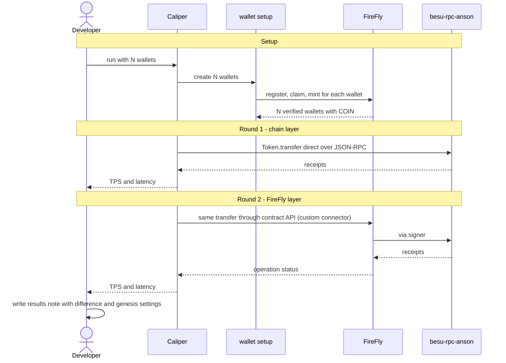

**Notes:**
- Traces to US-012, FR-13. Plan D-14, Phase 5.
- Setup can take longer than the rounds themselves (risk R7).
- Results describe this demo configuration (2s blocks, gas limit), not Besu limits (R13).
- Caliper has no FireFly connector, so round 2 uses a small custom connector (proven in Phase 0). Caliper 0.6.0 is used because 0.7.1 dropped the Ethereum connector.
- Test: none pass/fail. The check is that both reports exist and the note states the configuration.

---

## UC-11: Handle a write that does not finish

**Goal:** The CLI never claims success for a write whose final status is unknown.

**Trigger:** A FireFly write stays pending past the CLI timeout.

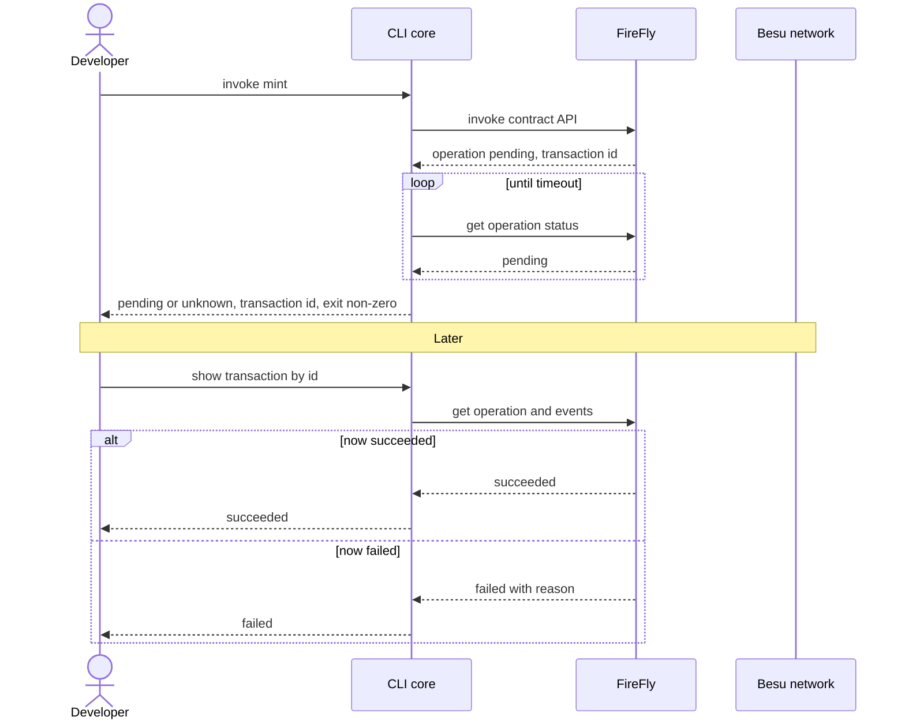

**Notes:**
- Traces to US-010, FR-9. Architecture §5 lifecycle and §3 failure handling.
- Re-sending the same write is safe for onboarding because UC-05 checks state first. For other writes, FireFly idempotency options are an open question (plan Q7).
- Test: `test_cli_never_reports_success_from_pending`, unit test with a mocked port.

---

## Coverage

| UC | User stories | Test |
|---|---|---|
| UC-01 | US-001 | document |
| UC-02 | US-002, US-003 | `test_network_consistency` |
| UC-03 | US-002 | `test_single_validator_failure` |
| UC-04 | US-005, US-006 | `test_trex_deployed_through_firefly` |
| UC-05 | US-007 | `test_onboarding_is_idempotent` |
| UC-06 | US-008 | `test_transfer_between_verified_identities` |
| UC-07 | US-008 | `test_compliance_rejection` |
| UC-08 | US-009 | `test_noto_private_transfer` |
| UC-09 | US-004, US-005 | `test_reset_repeatability` |
| UC-10 | US-012 | report files |
| UC-11 | US-010 | unit test, mocked port |

All use cases are MVP. Post-MVP flows (Zeto, Pente, Paladin in the CLI, multi-party) have no use case yet and would need a new `/grill-me` pass.
