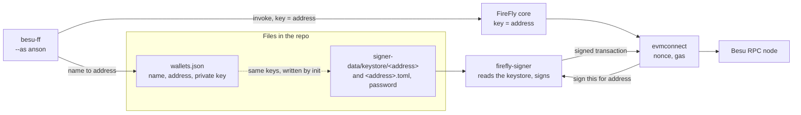

# Wallets in this project

What a "wallet" is here, where its pieces live, how one is created, how the network comes to accept it, and how to add one. Everything below was checked against the code, and the **add a wallet** procedure (section 5) was run on a live stack: a new wallet `carol` was created, verified, minted COIN, and used to send a transfer.

**Short answer.** There is no wallet application. A wallet is a **private key** plus three things that make the network accept it: a **keystore file** that FireFly's signer can read, an **entry in `wallets.json`** that gives it a name, and (for `COIN`) an **on-chain identity** that makes it a verified investor. The project's own code only generates keys and writes files; signing is done by FireFly's signer, a separate container.

---

## 1. Composition

| Piece | What it is | Where | Who makes it |
|---|---|---|---|
| **Private key** | 32 random bytes. The key is the wallet | `network-config/wallets.json` (`privateKey`) | `init`, with the `eth_account` library (`src/adapters/besu_config.py`, `generate_wallets`) |
| **Address** | `0x` + 40 hex characters, derived from the key. This is the only thing the chain and the FireFly Explorer know | `wallets.json` (`address`, lower case) | Derived from the key (`derive_address`, checked by `verify_wallet`) |
| **Name** | A label (`admin`, `anson`, `beatrice`) used by `besu-ff` (`--as anson`, `@anson`) and by the deploy code. Never on the chain | `wallets.json` (`name`) | You, unique per wallet (`build_wallets_document` rejects duplicates) |
| **Keystore file** | The key encrypted as a standard Ethereum keystore (scrypt), one file per key, **named by the address without `0x`** | `network-config/firefly/signer-data/keystore/<address>` | `src/core/firefly/keystore.py` |
| **Keystore descriptor** | A `.toml` beside it that says where the key file and the password are, from inside the signer container | `.../keystore/<address>.toml` | Same code |
| **Password** | One password for every keystore (a demo value) | `.../signer-data/password` | Same code |
| **On-chain identity** (`COIN` only) | An OnchainID contract for the wallet, an entry in the identity registry, and a KYC claim signed by the claim issuer | On the chain | `deploy` / `onboard` (`src/adapters/trex_onboard.py`) |



- **`wallets.json` is read by the tools, the keystore by the signer.** Both hold the same keys. The signer never reads `wallets.json`, and `besu-ff` never reads the keystore; `besu-ff` only turns a name into an address and tells FireFly to send **from that address**.
- **`besu-ff` does not sign.** FireFly passes the address to evmconnect, which asks the signer to sign for it. If the signer has no keystore for that address, the write fails.
- **The signer reads its folder only when it starts.** A keystore added later is not seen until the container restarts (see section 5, step 3). The signer takes the address from the **file name**, so a file with a different name is not found.
- **No funding is needed.** The chain is a zero-gas QBFT chain (`zeroBaseFee`, `--min-gas-price=0`, empty `alloc` in `genesis.json`), so a new address can send immediately.
- **Admin is the default key** of the FireFly namespace (`core.yml`, from the wallet named `admin`), and the deployer, the token agent and the KYC claim issuer. Anson and Beatrice are the investors.

The three committed wallets are throwaway **demo** keys (`wallets.json` says so). Never use them, or this layout, for a real key.

## 2. The wallets in this repo

| Wallet | Made by | Used for |
|---|---|---|
| `admin`, `anson`, `beatrice` | `init` (random each time `init` runs with `--force`; the committed ones are fixed) | The demo: deploy, mint, transfer, burn |
| `perf-001` ... `perf-NNN` | `python scripts/stack.py perf-setup`, derived from a public seed (`src/core/perf/wallets.py`), so that Caliper and FireFly's signer have the same keys | The benchmark. Two sets, one per layer, because evmconnect works out nonces from its own records and falls behind a key that was also sent from directly |
| The validators' keys | `init`, under `network-config/validator-keys/` | Producing blocks. **Not wallets** in this sense: they are never used to send transactions |
| Paladin node keys | Paladin itself: each node's config has a 12-word mnemonic (`wallets: ... type: bip32`) and derives keys from it. Names like `anson@node2` are Paladin identities | Paladin transactions. A separate world: Paladin does not use `wallets.json` or the FireFly signer (see [paladin-guide.md](paladin-guide.md)) |

## 3. How a wallet is created

`init` does it: for each name in `("admin", "anson", "beatrice")` it calls `Account.create()`, keeps the lower-cased address and the private key, and writes:

1. `network-config/wallets.json`, after `build_wallets_document` has checked that every address matches its key and every name is unique;
2. the keystore files, descriptors and password, through `write_firefly_files` (which also removes any earlier `signer-data/` so the keystores of replaced wallets do not linger, and sets `admin` as FireFly's default key).

`init` makes **all** the files again, including the chain's genesis and keys, so it is a way to start a new network. It is **not** a way to add one wallet to a running network: use section 5.

## 4. How the network accepts a wallet

Three separate gates, in this order:

| Gate | Question | Where it is decided | A new wallet needs |
|---|---|---|---|
| **Can it send?** | Can FireFly's signer sign for this address? | The signer's keystore folder | The keystore file, then a signer restart |
| **Is it allowed on the chain?** | Does Besu accept the transaction? | Besu: any address may send, gas costs 0 | Nothing |
| **Can it hold `COIN`?** | Is it a verified investor, so a transfer to it passes the compliance check? | The token's identity registry and claim issuer | An OnchainID identity, an identity-registry entry, and a KYC claim (`registerIdentity`, `addClaim`) |

A wallet that passes only the first two can send transactions, but `COIN` refuses to move **to** it: `error: refused by the contract: Transfer not possible` (or `Identity is not verified.` for a mint). That is the contract working as designed; Admin gets this answer too, because Admin is an agent but is never verified.

## 5. How to add a wallet (run on a live stack)

**Needs:** the stack up and deployed (README, quick route), and the virtual environment active. Pick a name, here `carol`. Save this as `add_wallet.py` in the repo root (it uses the project's own functions, so it creates exactly what `init` and `onboard` create):

```python
"""Add a wallet to the demo network: python add_wallet.py NAME  (stack up and deployed)."""

import json
import sys
from pathlib import Path

from eth_account import Account

from src.adapters.addresses import DEPLOYED_ADDRESSES, read_addresses
from src.adapters.firefly import FireflyClient, http_transport
from src.adapters.perf_wallets import load_perf_wallets
from src.adapters.trex_artifacts import load_artifact
from src.adapters.trex_onboard import issue_claims, register_identities
from src.core.network.wallets import (
    Wallet,
    account_addresses,
    build_wallets_document,
    wallet_private_key,
)

name = sys.argv[1]
path = Path("network-config/wallets.json")
document = json.loads(path.read_text(encoding="utf-8"))

account = Account.create()
wallet = Wallet(name, str(account.address).lower(), "0x" + account.key.hex())
known = [Wallet(w["name"], w["address"], w["privateKey"]) for w in document["wallets"]]

# 1. the name, address and key go into wallets.json (names must be unique)
document = build_wallets_document(known + [wallet])
path.write_text(json.dumps(document, indent=2) + "\n", encoding="utf-8")
# 2. the signer gets a keystore for it and is restarted if it does not list it yet
load_perf_wallets([wallet])
# 3. T-REX onboarding: identity, registry entry, KYC claim signed by the issuer (admin)
client = FireflyClient(http_transport())
addresses = read_addresses(DEPLOYED_ADDRESSES)
accounts = account_addresses(document)
register_identities(client, load_artifact, addresses, accounts, print, names=[name])
issuer_key = wallet_private_key(document, "admin")
issue_claims(client, load_artifact, addresses, accounts, issuer_key, print, names=[name])
print(f"{name}  {wallet.address}")
```

```bash
python add_wallet.py carol
```

Expected output (the address differs, because the key is random):

```text
carol  identity created
carol  registered
carol  verified (KYC claim added)
carol  0x752e3b6028fdc6358e654ee80c6b4525f885e37a
```

What each step of the script did:

1. **`wallets.json`** now has `carol`. From now on `besu-ff` understands `--as carol` and `@carol`.
2. **The keystore:** `load_perf_wallets` writes `keystore/<address>` and `.toml` (it never rewrites or removes an existing one), then **restarts the `firefly-signer` container** if the running signer does not list the address yet, and waits until it does. This takes a few seconds.
3. **The identity:** `register_identities` has Admin create an OnchainID for `carol` and add it to the identity registry; `issue_claims` has the claim issuer (Admin's key) sign a KYC claim that Carol's identity stores. After this, `carol` is **verified**.

**Prove it** (the numbers are from the run that was checked):

```bash
besu-ff invoke mint --contract coin --as admin --input _to=@carol --input _amount=10000000000000000000
besu-ff invoke transfer --contract coin --as carol --input _to=@anson --input _amount=4000000000000000000
#   balance    carol  6000000000000000000
#   balance    anson  1004000000000000000000
```

Then watch it in the FireFly Explorer (**Activity > Operations**): the transfer's `key` is Carol's address, which is the proof that the signer signed with the new keystore. [README.md](../README.md) section "Try mint, transfer and burn" shows how to read each field.

**What this does not do, on purpose:**

- **`scripts/stack.py onboard` does not know `carol`.** `python scripts/stack.py onboard` only handles `ONBOARD_ACCOUNTS = ("anson", "beatrice")`; the script above passes `names=[...]` to the same functions instead.
- **It does not mint COIN to her** (that is a normal Admin write, shown above), and it does not touch Paladin.
- **It edits `wallets.json`, which is committed.** The keystore files of new wallets are ignored by git (`.gitignore`), so a clone does not get `carol`. To undo it: `git checkout network-config/wallets.json`, delete her keystore files, or `python scripts/stack.py reset`.

### Variations

| You want | Do |
|---|---|
| A wallet that only **sends** (no `COIN`) | Steps 1 and 2 of the script only |
| A wallet that **receives** `COIN` | All three steps |
| A key you **already have** | Replace `Account.create()` with `Account.from_key("0x...")`: the rest is the same. The keystore is made from the key |
| Many wallets | `python scripts/stack.py perf-setup --wallets N --coins C` makes `2N` derived wallets verified and funded in one go |
| An agent, or a different claim issuer | Not covered by this project: they are set when the token is deployed (`deployTREXSuite`) |

## 6. Rotate or remove a wallet

- **Remove from signing:** delete `keystore/<address>` and `.toml`, restart `firefly-signer`. FireFly can no longer send from it (the address and its balance stay on the chain).
- **Remove from `COIN`:** an agent calls `deleteIdentity` on the identity registry (Admin signs; no helper in this project). Without it, a verified wallet stays verified even if its keystore is gone.
- **Replace the key:** the address changes with the key, so this is a new wallet. Move the `COIN` with a transfer from the old one first, or a burn and mint by Admin.

## 7. What is different in production

This layout (keys in a Git repository, one shared password, files on a disk) is for a demo network. [production-step-by-step.md](production-step-by-step.md) (steps 3 and 7) describes the real setup: keys generated where they will live (HSM or cloud KMS), signing roles separated, a custody and rotation policy, and no key in Git. The shape does not change: FireFly asks a signer to sign for an address. What changes is **what the signer is**. Replacing the file-based signer with an HSM or KMS-backed one was not built or tested in this project.

## 8. Where it lives in the code

| Concern | File |
|---|---|
| Key generation, `init` | `src/adapters/besu_config.py` (`generate_wallets`) |
| Wallet type, address derivation, `wallets.json` content and its checks | `src/core/network/wallets.py` |
| Keystore, descriptor and password content | `src/core/firefly/keystore.py` |
| Writing the signer's folder, default key | `src/adapters/firefly_files.py`, `src/core/firefly/config.py` |
| Adding keystores to a live signer, restart | `src/adapters/perf_wallets.py` (`load_perf_wallets`) |
| T-REX identity, registry, claim | `src/adapters/trex_onboard.py`, `src/core/trex/claims.py`, `src/core/trex/onboarding.py` |
| Names to addresses in the CLI | `src/adapters/ff_cli.py` (`_wallets`), `src/core/firefly/inputs.py` |
| Benchmark wallets | `src/core/perf/wallets.py`, `src/adapters/perf_setup.py` |
