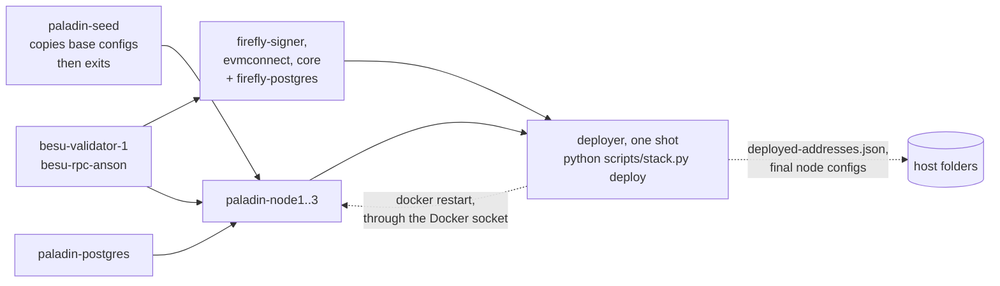

# Tasks — Phase 6: one `docker compose up` for the whole stack

> Source: the request of 2026-10-05 ("why is there not a complete docker-compose network to start up all containers?", then "option b and c is probably easier for me to understand and learn"). Builds on `docker-compose.yml`, `src/adapters/stack_cli.py` (`up`, `deploy`, `reset`), `src/adapters/paladin_command.py`, `src/adapters/paladin_files.py` and plan D-09 and D-16. Phases 1 to 5 are complete and reviewed; their lists are `tasks/phase-1-network.md` to `tasks/phase-5-caliper.md` (Phase 5 was archived on 2026-10-05 with every box ticked).
> **Status: approved by Howin on 2026-10-05 (Open Question 1: yes, accept the Docker socket for the demo; the others as recommended).**

## Overview

Today a plain `docker compose up` starts the infrastructure only. Two things are missing, and each is what this phase adds:

- **Option b, the Paladin configuration.** The three Paladin nodes read `./paladin-runtime/nodeN`, a folder that is not in Git and that `python scripts/stack.py up` creates by copying `network-config/paladin/`. A one-shot **`paladin-seed` service** will do that copy inside Compose, so a fresh clone needs nothing before `docker compose up`.
- **Option c, the contracts.** `python scripts/stack.py deploy` deploys the T-REX suite through FireFly, creates `COIN`, onboards Anson and Beatrice, mints 1000 COIN, and runs the two-phase Paladin bootstrap (deploy the registry and Noto contracts through node1, write the final node configs, **restart** the three nodes, register them). A one-shot **`deployer` service**, built from a small image of this repository, will run that same command inside Compose after everything it needs is healthy.

The result is that `docker compose up` brings up all 10 containers and then deploys everything, and the job container is visible in `docker compose ps -a` and `docker compose logs deployer`, which is the point of the exercise: the whole story is in one declarative file. `python scripts/stack.py up | deploy | reset` stays, for the step-by-step route and for the tests.

Design choices that apply to every task:
- **Keep what works.** The `deploy` logic is not rewritten; the job runs the same command. `stack.py up`, `deploy` and `reset` and the 116 integration tests keep working unchanged, which also proves the job did the same thing (Open Question 2).
- **The restart needs the Docker socket.** The Paladin bootstrap restarts the three nodes, and a container can only do that through the host's Docker. The `deployer` mounts `/var/run/docker.sock`. That gives the job control of Docker on your machine, which is acceptable for a local demo and is not something to copy into production (Open Question 1).
- **Files stay on the host.** The job works on a bind mount of the repository, so `deployed-addresses.json` and `paladin-runtime/` appear in the same places as today and both routes share them.
- **Service addresses become settings.** The Python code reaches FireFly, Besu and Paladin at `localhost` ports. Inside Compose those are `firefly-core:5000`, `besu-rpc-anson:8545` and `paladin-nodeN:8548`. They become environment variables with the current values as defaults.
- **Layers (`PROJECT.md`).** Only adapters change (settings read from the environment). `src/core/` is untouched.
- **Tests.** Unit tests for the settings. One new integration test for the compose route, behind its own marker so it never runs by accident (it resets the stack). The exit gate repeats `docker compose up` from a clean state three times.
- **Verification commands** (from `PROJECT.md`): `ruff check .`, `mypy .`, `pytest`, `pytest -m integration`, `docker compose config -q`. New: `docker compose build deployer`, `docker compose up`, and `pytest -m fresh_stack` (defined in Task 5).
- **Working branch:** `main`, committing per task.

Sizes: no task is L or larger. Tasks 3 and 4 are the largest (M).

---

## Group A — The pieces

### Task 1: Service addresses come from the environment

**Description:** `http_transport` in `src/adapters/firefly.py`, `PALADIN_NODES` in `src/adapters/paladin.py` and `RPC_NODES` in `src/adapters/rpc.py` get their addresses from `FIREFLY_URL`, `BESU_RPC_URL` and `PALADIN_NODE1_URL`, `PALADIN_NODE2_URL`, `PALADIN_NODE3_URL`, and fall back to today's `localhost` values when the variable is not set. Nothing else changes.

**Acceptance criteria:**
- [x] With no variables set, every address is exactly what it is today (unit-tested, so `stack.py` behaves identically)
- [x] With the variables set, each client uses the new address (unit-tested for FireFly, Besu and the three Paladin nodes)
- [x] An empty or malformed value is refused with a message naming the variable

**Verification:**
- [x] Tests pass: `pytest tests/unit`
- [x] Checks clean: `ruff check .` and `mypy .`

**Dependencies:** None

**Files likely touched:**
- `src/adapters/firefly.py`, `src/adapters/paladin.py`, `src/adapters/rpc.py`, `src/adapters/perf_wallets.py` (its fixed `localhost:8545` is inside the signer container, so it stays)
- `tests/unit/adapters/test_firefly.py`, `test_paladin.py`, `test_rpc.py`

**Size:** S

**Status:** Done 2026-10-05. Test-first (12 unit tests). `src/adapters/settings.py` has `service_url(name, default, env)`: unset gives the default, a set value must be an `http://` or `https://` address with a host (a trailing slash is dropped), otherwise a `ValueError` names the variable. `firefly_url()`, `rpc_nodes()` and `paladin_nodes()` use it; `http_transport()` now takes `base_url=None` and reads `FIREFLY_URL`; `PALADIN_NODES` and `RPC_NODES` keep their names and are computed from the environment when the module is imported, so no caller changed. A bad value therefore fails at import with the variable's name in the message. `perf_wallets.py` keeps its `localhost:8545` because that call runs inside the signer container.

### Task 2: `paladin-seed` service (option b)

**Description:** Add a one-shot service to `docker-compose.yml` using a small image (`alpine`), mounting `./network-config/paladin` read-only and `./paladin-runtime` read-write, that copies each node's base config into `paladin-runtime/` **only if it is not there yet** (so a later `deploy` that has already written the final config is never overwritten). The three Paladin nodes get `depends_on: paladin-seed: condition: service_completed_successfully`. `stack.py up` keeps its own copy step, which does the same thing and stays harmless.

**Acceptance criteria:**
- [x] From a clean clone (no `paladin-runtime/`), `docker compose up -d` brings up all 10 containers healthy with no `stack.py` call (contracts not deployed yet), and `paladin-seed` has exited with code 0
- [x] Running `docker compose up -d` again leaves an existing `paladin-runtime/` untouched, checked by a changed file surviving
- [x] `python scripts/stack.py up` and `deploy` still work on top of it

**Verification:**
- [x] Tests pass: `docker compose config -q`; the two manual runs above, recorded in the status
- [x] Checks clean: `ruff check .` and `mypy .`

**Dependencies:** None

**Files likely touched:**
- `docker-compose.yml`

**Size:** S

**Status:** Done 2026-10-05. `paladin-seed` (alpine, `restart: "no"`) copies each node's base config only when missing and logs `base config copied` or `config already there, kept`; the Paladin nodes wait for it through the shared `x-paladin` anchor. Real runs: from `down -v` with no `paladin-runtime/`, a plain `docker compose up -d` started all 10 containers in 43 s (every one healthy within about a minute) and `paladin-seed` exited 0; a marker line added to node1's config survived a second run of the seed; `stack.py up` and `deploy` then worked on top (Coin, and `noto` on all three nodes). **One thing the task list did not foresee:** `stack.py up` waited for every service to be running and healthy, and `docker compose up -d` named no services, so a one-shot service that exits would have made `up` time out, and Task 4's `deployer` would have deployed during `up`. `DockerStack.up` now starts the long-running services by name and leaves out `ONE_SHOT_SERVICES` (`paladin-seed`, `deployer`); `paladin-seed` still runs as the nodes' dependency. 1 new unit test.

### Task 3: The deployer image, and proof the restart works from a container

**Description:** A `deploy/Dockerfile` (multi-stage) that gives the job what `deploy` needs: a Node stage that runs `npm ci` in `contracts/` for the pinned T-REX and OnchainID artifacts, and a Python stage that installs this project and the Docker CLI. It runs as a normal user where it can. **First step: prove the risky part** before building on it: from a container with `/var/run/docker.sock` mounted, `docker restart paladin-node1` works on this machine (Docker Desktop on Windows). If it does not, stop and take Open Question 1 back to Howin.

**Acceptance criteria:**
- [x] The image builds (`docker build -f deploy/Dockerfile`; the `deployer` service that makes it `docker compose build deployer` arrives in Task 4) and runs `python scripts/stack.py --help`
- [x] Probe recorded in `docs/spike-results.md`: a container with the socket mounted restarts `paladin-node1`, and what it needed (user, group, path)
- [x] The image contains the contract artifacts, so no host `npm ci` is needed for the compose route (checked by building from a clone without `contracts/node_modules`)

**Verification:**
- [x] Tests pass: `docker compose build deployer`; the probe command
- [x] Checks clean: `docker compose config -q`

**Dependencies:** Task 2 (it uses the same stack for the probe)

**Files likely touched:**
- `deploy/Dockerfile`, `.dockerignore`, `docs/spike-results.md`

**Size:** M

**Status:** Done 2026-10-05. Probe passed (details in `docs/spike-results.md`, Phase 6 findings): a root container with the socket mounted restarted `paladin-node1`. `deploy/Dockerfile` (multi-stage: Node for `npm ci`, then Python with the Docker client) builds in about 34 s and holds only dependencies, because Compose will mount the repository at `/work` and a mount hides anything baked in beneath it. So the contract packages are in `/opt/contracts/node_modules` and a new `CONTRACTS_NODE_MODULES` variable (`contracts_node_modules()` in `trex_artifacts.py`, default unchanged, 3 unit tests) points the code at them. Checked from a copy of the repository without `contracts/node_modules`: the image runs `stack.py --help` and loads a contract artifact. `.dockerignore` keeps the build context small.

### Task 4: `deployer` service (option c)

**Description:** Add the `deployer` service to `docker-compose.yml`: built from `deploy/Dockerfile`, `restart: "no"`, the repository bind-mounted so the files land where they do today, the Docker socket mounted, the environment of Task 1 pointing at the Compose service names, and `depends_on` with `service_healthy` for FireFly core, the RPC node and the three Paladin nodes. Its command is `python scripts/stack.py deploy`. `docker compose up` then does everything; the job's logs show the same lines `deploy` prints today.

**Acceptance criteria:**
- [x] From a clean clone, one `docker compose up` ends with the `deployer` exited with code 0, and `besu-ff query name --contract coin` answers `Coin`, Anson holds 1000 COIN, and `domain_listDomains` on each Paladin node returns `noto`
- [x] Running `docker compose up` again changes nothing and sends no transaction (the job is idempotent, as `deploy` is)
- [x] If the job fails, `docker compose ps -a` shows it with a non-zero exit code and `docker compose logs deployer` shows why, and a second `docker compose up` finishes the interrupted run

**Verification:**
- [x] Tests pass: the manual runs above, with the real output recorded in the status
- [x] Checks clean: `docker compose config -q`; `ruff check .` and `mypy .`

**Dependencies:** Tasks 1, 2 and 3

**Files likely touched:**
- `docker-compose.yml`

**Size:** M

**Status:** Done 2026-10-05. `deployer` added to `docker-compose.yml` (built from `deploy/Dockerfile`, repository mounted at `/work`, Docker socket mounted, `FIREFLY_URL`, `BESU_RPC_URL` and `PALADIN_NODE1_URL` to `PALADIN_NODE3_URL` set to the Compose service names, `depends_on` FireFly core, the RPC node and the three Paladin nodes healthy). Real run from `down -v` with no host files: one `docker compose up -d` returned after 41 s with the deployer started, `docker wait deployer` returned `0` after 94 s more, and the log is the usual `deploy` output ending in `paladin registry  node3 transport.grpc set`. Then, with no `stack.py` involved: `deployed-addresses.json` and `paladin-runtime/node1/` are on the host, `besu-ff query name` answers `Coin`, Anson holds 1000 COIN, and `domain_listDomains` answers `noto` on 8548, 8648 and 8748. A second `docker compose up -d` re-ran the job, which printed `(already deployed)` and `(already unpaused)` lines, left `deployed-addresses.json` byte-identical and Anson's balance at 1000. Failure is visible: with `FIREFLY_URL` unreachable the job exits `1`, and with `FIREFLY_URL=nonsense` it stops at once with `ValueError: FIREFLY_URL must be an http:// or https:// address`. Finishing an interrupted run is the same `deploy` code that `test_an_interrupted_deploy_is_finished_by_running_deploy_again` already covers, so it was not simulated again here.

---

## Checkpoint: After Tasks 1–4

- [x] `docker compose up` from a clean state gives a deployed stack (checked above); `stack.py up` then `deploy` on top of a seeded stack gave the same one (Task 2), and a full `pytest -m integration` on each route is Task 5
- [x] The restart-from-a-container probe is recorded (`docs/spike-results.md`)
- [x] `ruff check .`, `mypy .`, `pytest` (577) pass
- [ ] Human review before proceeding (**waiting for Howin**)

---

## Group B — Proof and documentation

### Task 5: Fresh-stack test and repeatability

**Description:** A test `tests/integration/test_compose_up.py` behind a new marker `fresh_stack` (not `integration`, because it destroys the stack and so must never run inside `pytest -m integration`): it runs `docker compose down -v` and removes `paladin-runtime/` and `deployed-addresses.json`, runs `docker compose up -d`, waits for the `deployer` to exit, and asserts exit code 0, the `COIN` name, the 1000 COIN balance and the three Noto domains. Then repeat the whole thing three times in a row, and run `pytest -m integration` once on a stack that came from `docker compose up`, to show the two routes give the same stack.

**Acceptance criteria:**
- [ ] `pytest -m fresh_stack` passes three times in a row, each from a clean state
- [ ] `pytest -m integration` (116 tests) passes on a stack started only by `docker compose up`
- [ ] The marker is registered in `pyproject.toml`, and `pytest` and `pytest -m integration` do not run the new test

**Verification:**
- [ ] Tests pass: `pytest -m fresh_stack` three times; `pytest -m integration`
- [ ] Checks clean: `ruff check .` and `mypy .`

**Dependencies:** Task 4

**Files likely touched:**
- `tests/integration/test_compose_up.py`, `pyproject.toml`

**Size:** M

### Task 6: Documentation

**Description:** Update `README.md` so the first path is `docker compose up` (and how to watch it: `docker compose logs -f deployer`, `docker compose ps -a`), with the `stack.py` steps kept as the second, step-by-step route; how to tear down (`docker compose down -v`, plus `python scripts/stack.py reset` for the host files); and what the `deployer` and its Docker socket mean. Update `PROJECT.md` (commands, layout), `docs/architecture.md` (the deployment model paragraph and the container list), `docs/plan.md` (a Phase 6 entry with the result) and `docs/production-step-by-step.md` (the demo's deployer is a convenience, not a pattern for production: a production deploy runs from a pipeline with approvals). Verify the README steps from a fresh clone.

**Acceptance criteria:**
- [ ] A reader can go from `git clone` to a deployed stack with `docker compose up` alone, and the README says what to expect and how long it takes (measured)
- [ ] The README explains the Docker socket in plain words and says it is for the local demo only
- [ ] The fresh-clone check is recorded in this list

**Verification:**
- [ ] Tests pass: follow the README literally from a fresh clone, then `docker compose down -v`
- [ ] Checks clean: `ruff check .` and `mypy .`

**Dependencies:** Task 5

**Files likely touched:**
- `README.md`, `PROJECT.md`, `docs/architecture.md`, `docs/plan.md`, `docs/production-step-by-step.md`

**Size:** S

---

## Checkpoint: After Tasks 5–6 (exit gate)

- [ ] `pytest -m fresh_stack` passes three times in a row
- [ ] `pytest -m integration` passes on a stack started by `docker compose up`
- [ ] `ruff check .`, `mypy .`, `pytest` pass
- [ ] Human review of the Phase 6 exit gate (**waiting for Howin**)

---

## Open Questions

| # | Question | Owner | Recommended default |
|---|---|---|---|
| 1 | The `deployer` must mount the Docker socket to restart the Paladin nodes, which lets the job control Docker on your machine. Accept that for the local demo? The alternative is to remove the restart by changing how the Paladin nodes load their domain config, which is a larger, riskier change to Phase 3. | Howin | Accept it for the demo, say so in the README, and say in `docs/production-step-by-step.md` that production does not do this |
| 2 | Keep `stack.py up`, `deploy` and `reset` working beside the new route? | Howin | Yes. The tests use them, they are the step-by-step route, and equal results from both routes is the proof |
| 3 | Where do the job's outputs live: the bind-mounted host folders (`deployed-addresses.json`, `paladin-runtime/`) or named volumes? | Howin | Host folders, so both routes share them and you can read the files |
| 4 | `docker compose down -v` does not remove the two host files. Is a manual removal (or `stack.py reset`) acceptable in the README, or should a `reset` service do it? | Howin | Manual: `stack.py reset` already does it, and a service that deletes host files is more risk than it is worth |
| 5 | The first `docker compose up` builds the deployer image, which downloads npm packages and takes a few minutes. Acceptable? | Howin | Yes, once; say so in the README |

## Notes

- Out of scope: running the job on Kubernetes (see `docs/production-step-by-step.md`), changing the Paladin two-phase bootstrap, a Compose profile for the benchmark, and publishing the deployer image to a registry.
- No `TBD` verification commands: every command above is in `PROJECT.md` or defined in this phase (`pytest -m fresh_stack`, Task 5).
- Phase 6 is about 1 to 2 days.
